+++
title = '[HTB Academy] — Shells & Payloads Lab 풀이'
date = 2026-05-08T17:00:00+09:00
draft = false
tags = ["HTB", "pentest", "shells", "payloads", "tomcat", "eternalblue", "metasploit"]
categories = ["HTB", "write-up"]
+++

## 개요

HTB Academy Shells & Payloads 모듈의 마지막 Lab이다. 내부망에 존재하는 세 개의 호스트를 순차적으로 공략해야 하며, 각 호스트마다 서로 다른 공격 벡터를 사용한다.

| 호스트 | IP | 공격 벡터 |
|--------|-----|-----------|
| Host1 | 172.16.1.11 | ASPX 웹쉘 업로드 (파일 업로드 취약점) |
| Host2 | 172.16.1.12 | Directory Listing → 자격증명 탈취 → Metasploit RCE |
| Host3 | 172.16.1.13 | EternalBlue + psexec → SYSTEM 권한 |

---

## Host1 — ASPX 웹쉘 업로드

### 정찰

```bash
nmap 172.16.1.11 -sC -sV --min-rate 4000
```

주요 포트:

```
80/tcp   open  http    Microsoft IIS httpd 10.0
445/tcp  open  microsoft-ds  Windows Server 2019
3389/tcp open  ms-wbt-server
8080/tcp open  http    Apache Tomcat 10.0.11
```

8080 포트에 Apache Tomcat이 올라와 있다. 80 포트는 IIS인데, 두 개의 웹서버가 같은 호스트에서 동작 중이라는 점이 흥미롭다. Tomcat Manager App을 통한 WAR 파일 업로드 공격을 먼저 떠올렸지만, 자격증명이 없는 상태라 다른 진입점을 먼저 찾아야 한다.

### vHost 발견

`/etc/hosts`를 확인해보니 `status.inlanefreight.local`이라는 도메인이 등록되어 있었다.

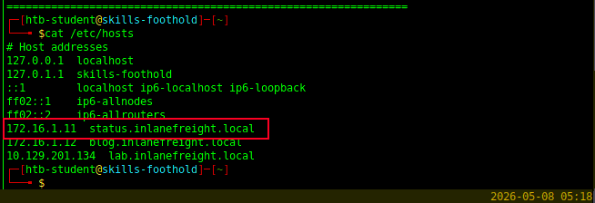

vHost 기반으로 동작하는 웹서버가 있다는 의미다. 해당 도메인으로 직접 접속을 시도한다.

### 파일 업로드 취약점 발견

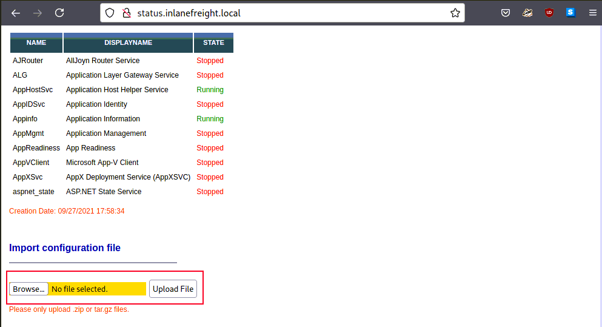

내부 관리자용 서버 상태 페이지가 열렸다. 페이지 하단에 설정 파일을 업로드하는 기능이 있었다. **파일 확장자 검사를 제대로 하지 않는다면 웹쉘 업로드가 가능하다.**

업로드할 페이로드의 형식을 결정하기 위해 서버 기술 스택을 먼저 파악한다.

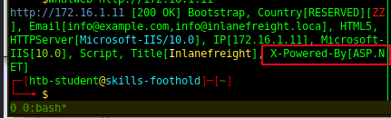

`whatweb`으로 확인한 결과 서버가 **ASP.NET** 기반으로 동작하고 있다. IIS + ASP.NET 환경이므로 `.aspx` 확장자의 웹쉘 페이로드를 사용해야 한다. PHP 웹쉘을 올리면 서버가 스크립트를 실행하지 않고 그냥 파일 내용을 반환하거나 오류를 낸다.

Kali에 기본 내장된 `/usr/share/webshells/aspx/` 경로에서 웹쉘을 가져와 업로드한다.

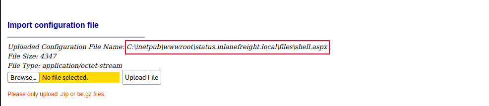

업로드가 성공했다. 응답에서 파일이 저장된 경로를 확인할 수 있었다.

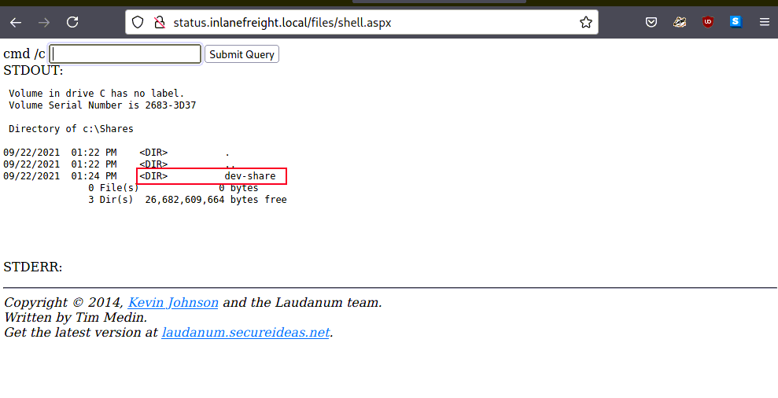

웹쉘을 통해 OS 명령어가 실행되는 것을 확인했다.

---

## Host2 — Directory Listing → 자격증명 탈취 → Metasploit RCE

### 정찰

```bash
nmap 172.16.1.12 --min-rate 4000
```

```
22/tcp open  ssh
80/tcp open  http
```

`/etc/hosts`에서 확인한 `blog.inlanefreight.local`로 접속한다.

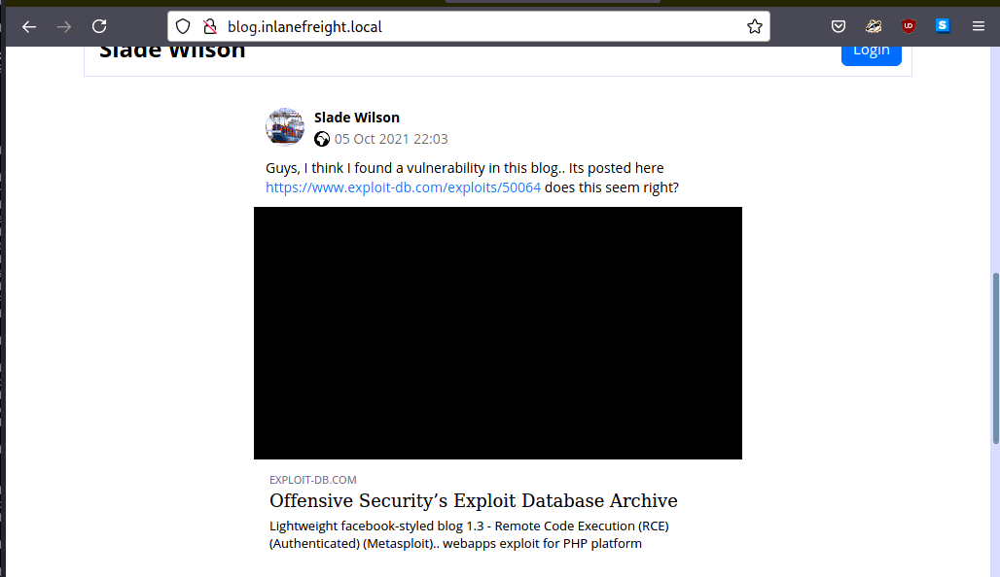

Lightweight facebook-styled blog 애플리케이션이 실행 중이다. 이 CMS는 Metasploit에 공개된 exploit(EDB-ID: 50064)이 존재한다. exploit 코드를 확인해보면 PHP로 작성되어 있으며, 인증된 관리자 계정으로 악성 PHP 파일을 업로드하는 방식이다. **자격증명 확보가 선행 조건이다.**

### 자격증명 탈취 — Directory Listing

gobuster로 디렉터리를 열거한다.

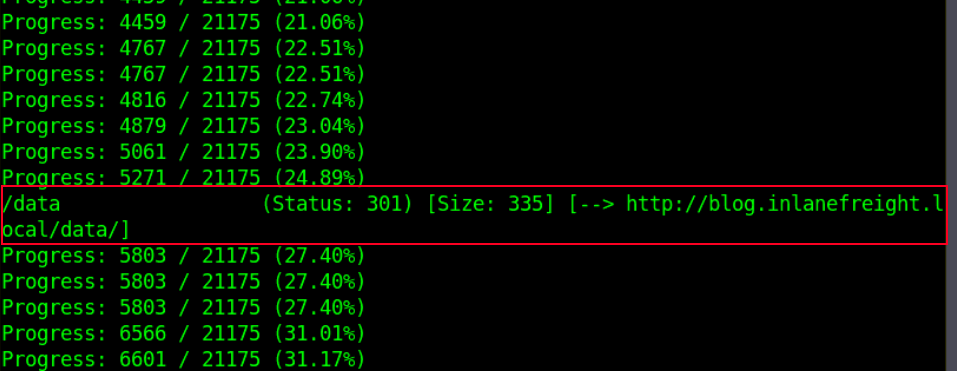

`/data` 경로가 발견됐다. 직접 접근해보니 Directory Listing 취약점이 있어 내부 파일이 그대로 노출됐다.

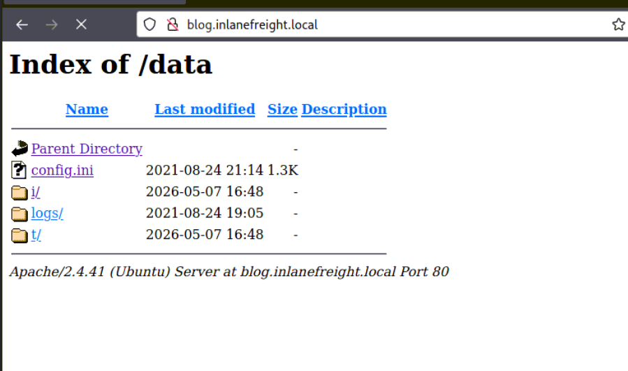

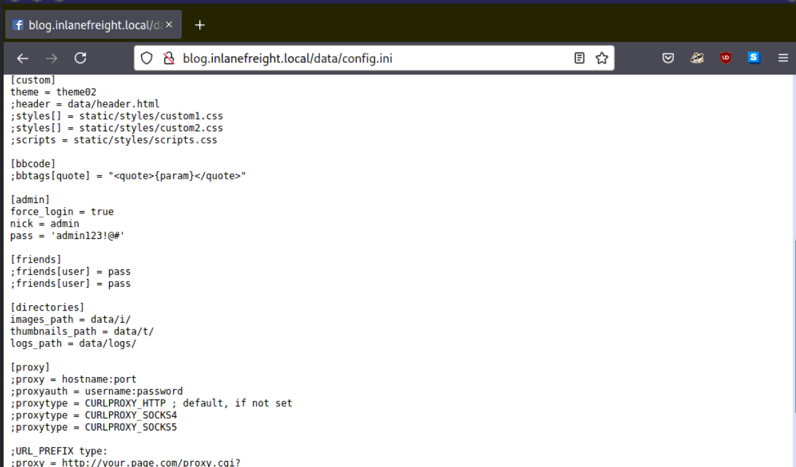

`config.ini` 파일 내부에 DB 자격증명과 블로그 관리자 계정이 **평문으로** 저장되어 있었다. 설정 파일을 외부에서 접근 가능한 디렉터리에 보관하는 것 자체가 취약점이고, Directory Listing이 활성화되어 있어 경로를 추측하지 않아도 파일 목록이 그대로 보인다.

### Metasploit으로 RCE

자격증명을 확보했으니 Metasploit으로 exploit을 진행한다. 초기 시도에서 `Unexpected JSON response` 오류가 발생했다.

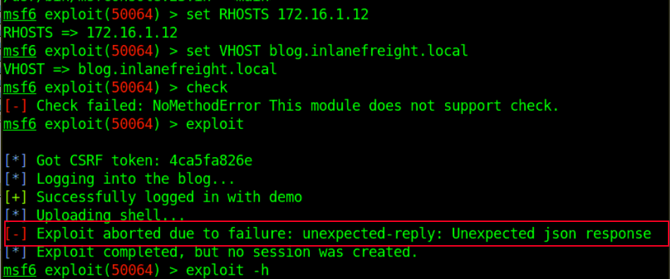

Burp로 요청/응답을 분석해보니, exploit 모듈이 내부적으로 로그인 요청을 보내는데 자격증명이 맞지 않아 인증에 실패하는 것이 원인이었다.

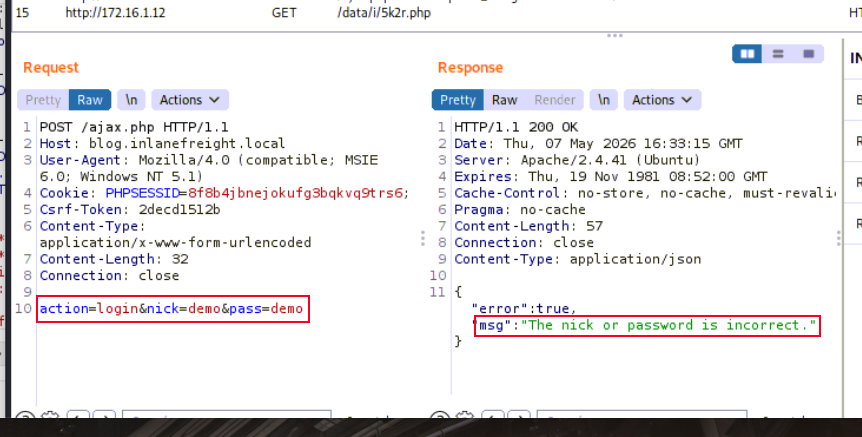

자격증명을 설정하고 재시도한다. 이번에는 Proxies 옵션이 남아있어 Burp를 통해 트래픽이 우회되면서 bind shell 연결이 실패했다. `unset Proxies` 명령으로 프록시 설정을 제거하고 다시 실행한다.

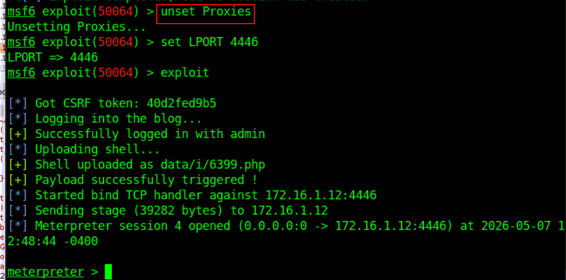

Meterpreter 세션을 획득했다.

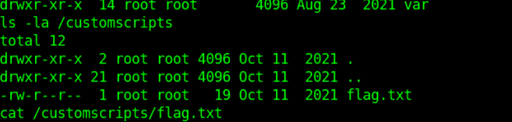

---

## Host3 — EternalBlue + psexec → SYSTEM

### 정찰

```bash
nmap 172.16.1.13 -sC -sV -p80,135,139,445 --min-rate 3000
```

```
80/tcp  open  http    Microsoft IIS httpd 10.0
445/tcp open  microsoft-ds  Windows Server 2016 Standard 14393
NetBIOS name: SHELLS-WINBLUE
```

호스트명이 `SHELLS-WINBLUE`다. Windows Server 2016 Build 14393 버전이며, 445(SMB) 포트가 열려있다. **이 버전대는 EternalBlue(MS17-010) 취약점 범위에 포함된다.**

SMB signing이 비활성화되어 있다는 점도 확인한다(`message_signing: disabled`). NTLM Relay 공격도 가능한 환경이지만, 이번 목표는 EternalBlue 직접 exploit이다.

### EternalBlue 취약점 확인

Metasploit에서 `exploit/windows/smb/ms17_010_eternalblue` 모듈을 로드하고 `check` 명령으로 취약 여부를 먼저 확인한다.

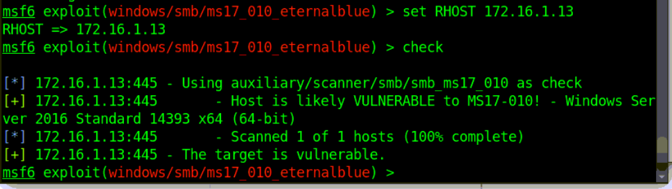

취약하다는 것이 확인됐다. exploit을 실행한다.

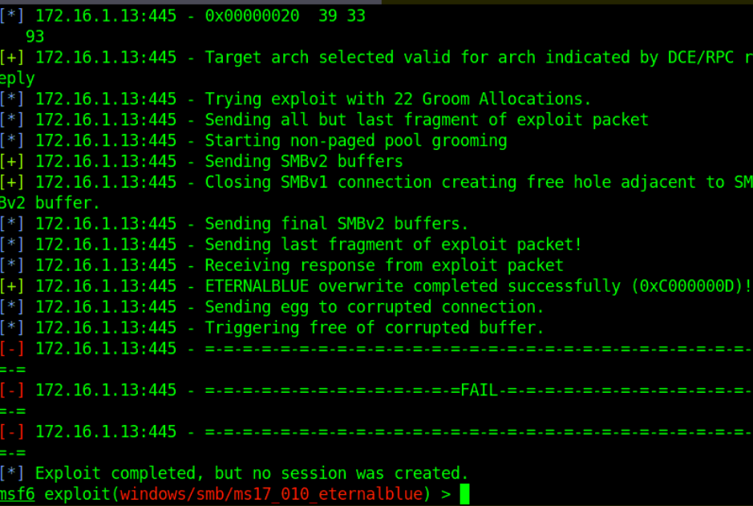

exploit이 실패했다. EternalBlue는 익스플로잇 자체가 불안정해서 실패율이 높다. HTB Academy에서 언급한 대로 **psexec를 활용한 방식으로 전환**한다.

`exploit/windows/smb/psexec` 모듈로 변경하고 실행했는데, exploit은 성공했지만 세션이 생성되지 않았다.

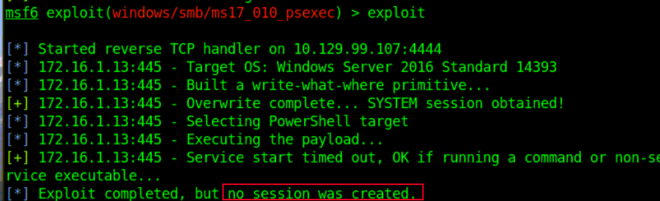

로그를 보니 `LHOST`가 HTB VPN의 외부 IP로 설정되어 있었다. 현재 구조를 다시 생각해보면:

```
공격자 (Kali) → RDP → Foothold 호스트 → 내부망 → 172.16.1.13
```

RDP로 내부망 Foothold 호스트에 접속한 상태에서 내부 타겟을 공격하는 중이다. 리버스 쉘은 **타겟이 공격자에게 연결을 시도**하는 방식이므로, 타겟(172.16.1.13) 입장에서 도달할 수 있는 주소를 LHOST로 설정해야 한다. 외부 VPN IP는 내부망에서 라우팅이 되지 않는다.

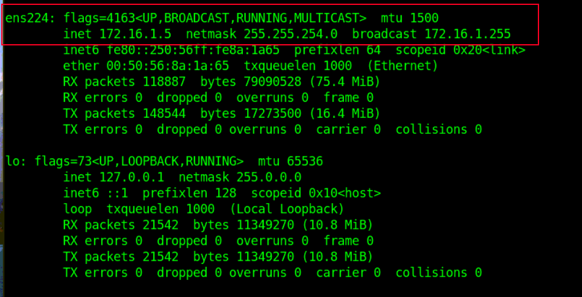

`ifconfig`로 내부망 IP를 확인한 뒤 LHOST를 내부망 IP로 변경하고 재시도한다.

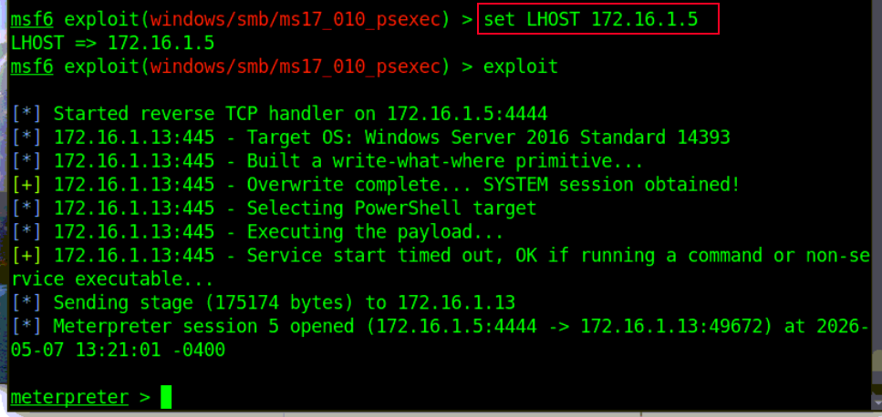

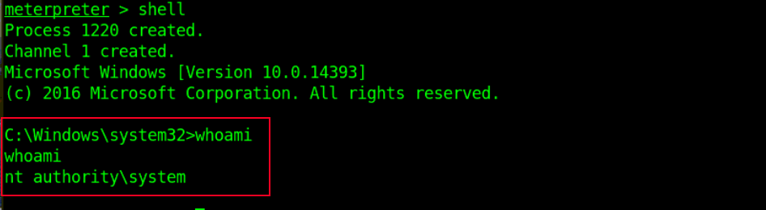

리버스 쉘 획득에 성공했다. psexec 모듈은 SMB를 통해 서비스를 원격 생성하는 방식으로 동작하기 때문에, 별도의 권한 상승 없이 **SYSTEM 권한**으로 쉘이 열린다.

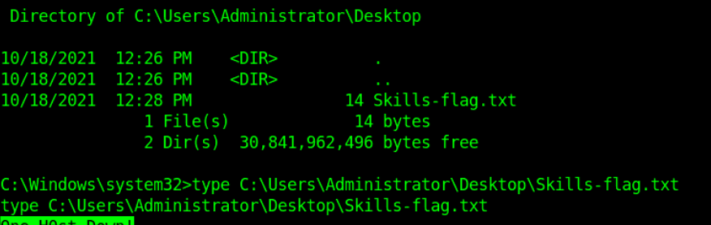

---

## 핵심 정리

**파일 업로드 시 서버 기술 스택을 먼저 파악한다.** ASP.NET이면 `.aspx`, PHP면 `.php` 웹쉘을 사용해야 한다. 잘못된 확장자를 올리면 코드가 실행되지 않고 그냥 파일이 반환된다.

**Directory Listing은 생각보다 치명적이다.** 경로를 추측하지 않아도 내부 파일이 전부 노출된다. `config.ini` 같은 설정 파일이 웹 루트 하위에 있으면 DB 자격증명, 관리자 계정이 한 번에 유출된다.

**EternalBlue는 불안정하다.** `check`로 취약 여부를 확인했더라도 exploit 자체가 실패할 수 있다. psexec 모듈이 더 안정적이며 SYSTEM 권한까지 바로 얻을 수 있다.

**내부망 pivot 상황에서 LHOST는 내부망 IP를 써야 한다.** 타겟이 연결을 시도할 때 도달 가능한 주소를 써야 하므로, VPN 외부 IP가 아니라 Foothold 호스트의 내부망 IP를 지정해야 한다. 리버스 쉘이 세션을 만들지 못하고 실패할 때 가장 먼저 확인할 것이다.

**Metasploit에서 Proxies 옵션을 쓴 이후에는 반드시 `unset Proxies`를 확인한다.** 트래픽 분석용으로 Burp를 연결해두면 exploit 완료 후 쉘 세션 연결 자체가 프록시를 통해 우회되면서 실패하는 경우가 있다.
